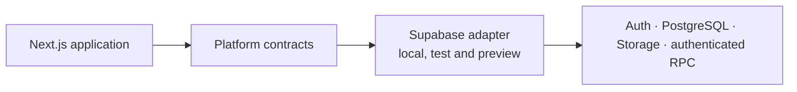

# Plataforma Estímulo

LMS para operar jornadas de desenvolvimento empreendedor, administrar conteúdos e atividades e produzir dados educacionais e operacionais com governança.

> **Status do projeto:** o fluxo de desenvolvimento e testes com Supabase está implementado.

[Índice da documentação](PROJECT_INDEX.md) · [Guia de contribuição](CONTRIBUTING.md) · [Estado da implementação](docs/implementation/APPLICATION_FOUNDATION.md)

## Sobre o projeto

A Plataforma Estímulo reúne, em uma aplicação web, as experiências de participantes e as ferramentas administrativas necessárias para publicar e operar jornadas de capacitação.

A primeira release tem como prioridade a **Jornada OpenAI**. O núcleo do produto, porém, foi estruturado para que jornadas, trilhas, conteúdos, avaliações e credenciais possam ser configurados e versionados sem criar um runtime separado para cada programa.

## Funcionalidades

### Participantes

- cadastro, confirmação de conta e autenticação;
- home, jornadas, atividades, diagnóstico, perfil, biblioteca e conquistas;
- acompanhamento de progresso e conclusão;
- avaliações, práticas, comentários e envio de evidências;
- pontos, recompensas, selos e certificados.

### Administração

- acesso administrativo separado com identidade interna e RBAC;
- configuração de produto, jornadas e diagnóstico;
- gestão de gamificação, engajamento, biblioteca e usuários;
- relatórios e ferramentas operacionais;
- contratos para integração com HubSpot.

### Fundação da plataforma

- motor de produto configurável e versionado;
- histórico PostgreSQL reproduzível por migrations;
- fronteiras explícitas para identidade, banco, arquivos e processamento assíncrono;
- seleção de provider por ambiente com comportamento *fail-closed*;
- contratos públicos de RPC e verificações permanentes do repositório.

A existência de uma tela, fluxo ou adapter no código não equivale à aprovação de conteúdo, metodologia, segurança, privacidade, acessibilidade ou operação em produção.

## Ambientes

| Ambiente | Provider | Estado |
|---|---|---|
| local, test e preview | `supabase` | suportado para desenvolvimento e validação |
| produção | `aws` | provider destinado ao ambiente de produção |

As regras são aplicadas por `APP_ENV` e `PLATFORM_RUNTIME_PROVIDER`.

## Arquitetura

O repositório é um monorepo npm. A aplicação principal é um monólito modular em Next.js, com os serviços de plataforma acessados por contratos independentes do provider.



## Stack principal

| Camada | Tecnologias |
|---|---|
| aplicação | Next.js 16, React 19 e TypeScript 6 |
| interface | Tailwind CSS 4, Framer Motion e Lucide |
| desenvolvimento e testes | Supabase Auth, PostgreSQL, Storage e Edge Functions |
| validação | Node Test Runner, scripts de contrato, gates de banco, typecheck e build |
| workspace | Node.js 22, npm 10 e npm workspaces |

## Começando

### Pré-requisitos

- Git;
- Node.js 22 ou superior;
- npm 10.9.2;
- acesso a um projeto Supabase autorizado;
- Google OAuth configurado no ambiente de teste para validar a administração;
- duas chaves independentes de 32 bytes, codificadas em Base64, para proteção do CPF.

### 1. Clone e instale as dependências

```bash
git clone https://github.com/pablo-marchina/LMS-estimulo.git
cd LMS-estimulo
npm ci --ignore-scripts
```

### 2. Crie o arquivo de ambiente

Linux ou macOS:

```bash
cp .env.example .env
```

PowerShell:

```powershell
Copy-Item .env.example .env
```

Para desenvolvimento local, mantenha:

```dotenv
APP_ENV=development
PLATFORM_RUNTIME_PROVIDER=supabase
NEXT_PUBLIC_APP_URL=http://localhost:3000
```

Preencha também as credenciais Supabase e as duas chaves de proteção do CPF indicadas em [`.env.example`](.env.example). Para gerar cada chave com Node.js, execute o comando abaixo duas vezes e use valores diferentes:

```bash
node -e "const { randomBytes } = require('node:crypto'); console.log(randomBytes(32).toString('base64'))"
```

Nunca versione o arquivo `.env` nem credenciais reais.

### 3. Valide a configuração local

```bash
npm run validate:repository
npm run validate:dependency-lock
npm run validate:platform-contract
```

### 4. Inicie a aplicação

```bash
npm run dev:web
```

A aplicação ficará disponível em `http://localhost:3000`.

### 5. Verifique o Supabase real

```bash
npm run verify:supabase
```

Essa verificação é *read-only*: ela consulta Auth, o readiness do PostgreSQL e a proteção da Edge Function `authenticated-rpc`, sem criar usuários nem alterar dados.

## Qualidade e testes

Validações principais:

```bash
npm run validate:repository
npm run validate:dependency-lock
npm run validate:application-foundation
npm run validate:platform-contract
npm run validate:migration-history
npm run test:repository-tooling
npm run test:application
npm run test:product
npm run test:integrations
npm run test:database
npm run typecheck:web
npm run build:web
```

Verificações adicionais:

```bash
npm run scan:secrets
npm run test:secret-scanning
npm run verify:deployment
```

`verify:deployment` é um smoke test autenticado e *read-only* de um ambiente implantado.

## Estrutura do repositório

```text
apps/web/                       aplicação Next.js
apps/web/lib/platform/          contratos e seleção do provider
apps/web/lib/supabase/          adapter de desenvolvimento e testes
config/platform/                contratos legíveis por máquina
docs/                           produto, decisões, arquitetura e implementação
scripts/                        validação, testes, segurança e operação
supabase/migrations/            histórico PostgreSQL executável e imutável
supabase/functions/             Edge Functions de desenvolvimento e testes
Dockerfile.lambda               imagem da aplicação para produção em Lambda
```

## Documentação

- [`PROJECT_INDEX.md`](PROJECT_INDEX.md) — índice canônico da documentação;
- [`MULTI_JOURNEY_PRODUCT_SCOPE.md`](docs/product/MULTI_JOURNEY_PRODUCT_SCOPE.md) — escopo das jornadas e da primeira release;
- [`APPLICATION_FOUNDATION.md`](docs/implementation/APPLICATION_FOUNDATION.md) — estado implementado;
- [`DELIVERY_BLOCKERS.md`](docs/implementation/DELIVERY_BLOCKERS.md) — lacunas para staging, produção e usuários reais;
- [`CONTRIBUTING.md`](CONTRIBUTING.md) — fluxo de mudanças e padrões do repositório.

## Contribuindo

Não faça commits diretamente em `main`.

1. Crie uma branch no formato `<tipo>/<escopo>-<descricao>`.
2. Mantenha código, migrations, contratos, testes e documentação sincronizados.
3. Execute as validações proporcionais ao risco da mudança.
4. Abra um pull request com título no padrão Conventional Commits.
5. Descreva evidências, limitações, riscos e estratégia de rollback.

As regras completas estão em [`CONTRIBUTING.md`](CONTRIBUTING.md).

## Suporte

Para dúvidas técnicas, defeitos ou propostas de melhoria, abra uma issue no repositório com contexto reproduzível e indique o ambiente e o provider afetados.
