# Visão geral da arquitetura

Este documento é o mapa de arquitetura da Plataforma Estímulo. Ele conecta os documentos especializados e mantém os diagramas canônicos necessários para compreender o sistema sem depender do contexto de uma entrega específica.

## 1. Contexto do sistema

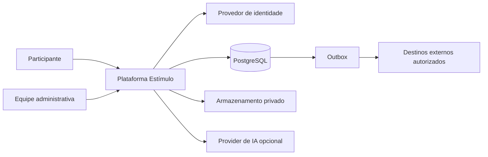

A plataforma é o sistema de registro das jornadas, diagnóstico, progressão, engajamento e evidências operacionais. Destinos externos não participam da transação síncrona do domínio.

## 2. Containers lógicos

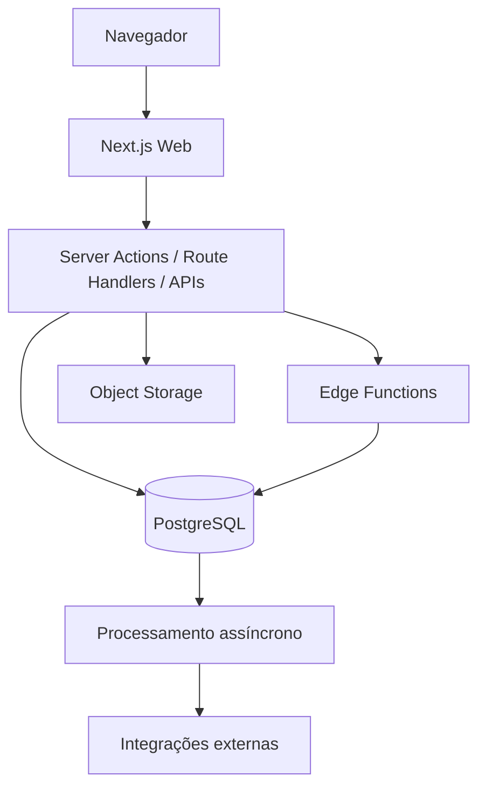

O domínio fica atrás de contratos server-side. O navegador nunca declara como fato final nota, conclusão, saldo, autorização ou elegibilidade.

## 3. Componentes da aplicação

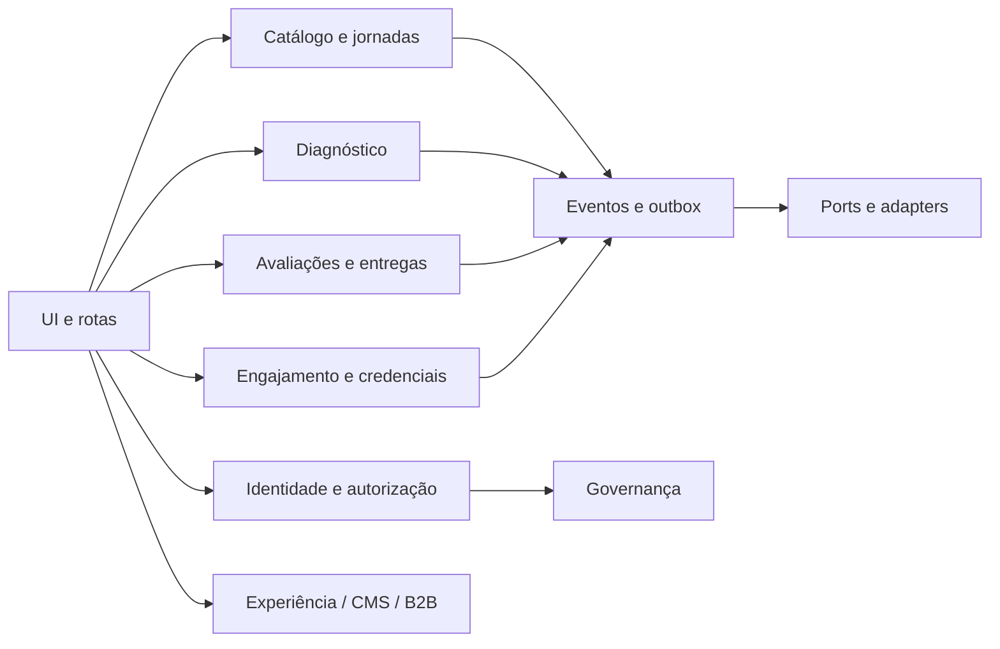

Os contextos detalhados estão em [`../domain/BOUNDED_CONTEXTS.md`](../domain/BOUNDED_CONTEXTS.md).

## 4. Modelo de dados por domínio

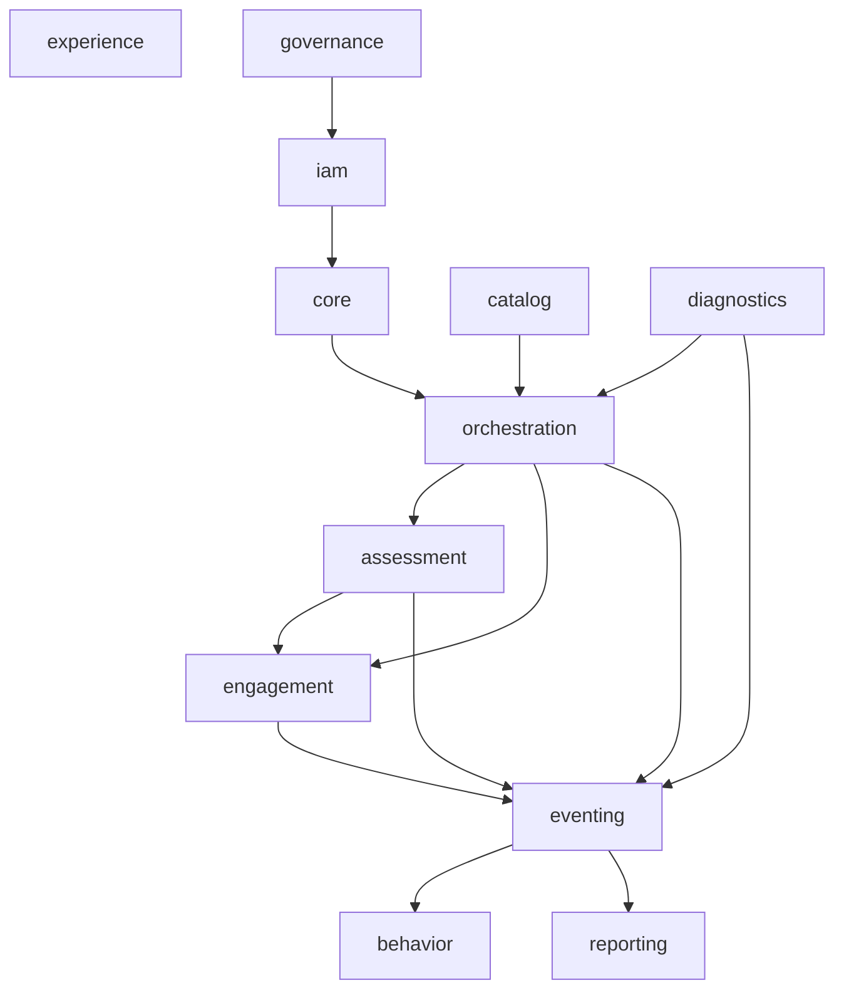

O ERD detalhado permanece em [`../data/database/DATABASE_ERD.md`](../data/database/DATABASE_ERD.md).

## 5. Autenticação e autorização

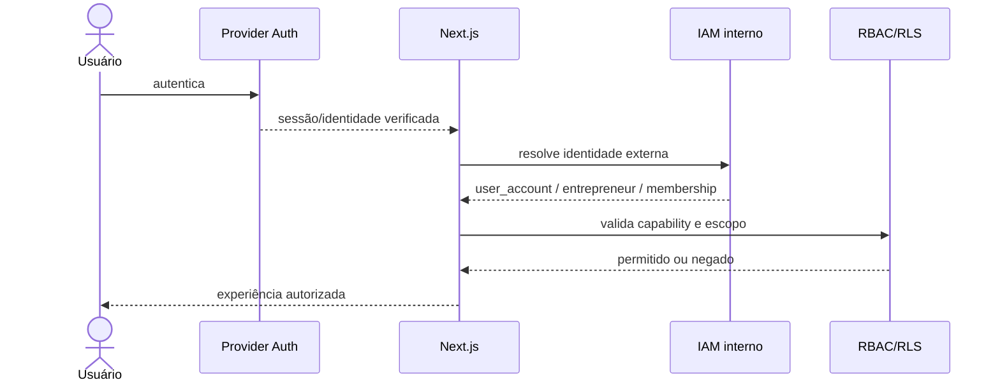

A resolução de identidade existente evita lock exclusivo no caminho comum e limita atualizações de heartbeat, reduzindo contenção em rajadas de RPCs autenticadas.

## 6. Jornada e aprendizagem

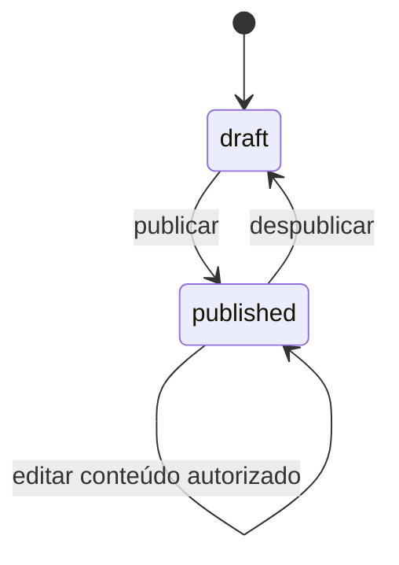

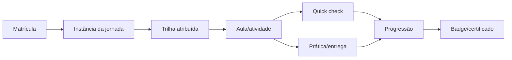

## 7. Diagnóstico

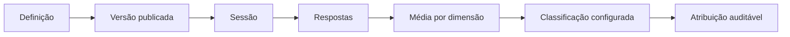

Thresholds configurados como limites superiores são avaliados do menor para o maior. O runtime não inventa pesos, cortes ou textos ausentes da metodologia aprovada.

## 8. Comando transacional, eventos e outbox

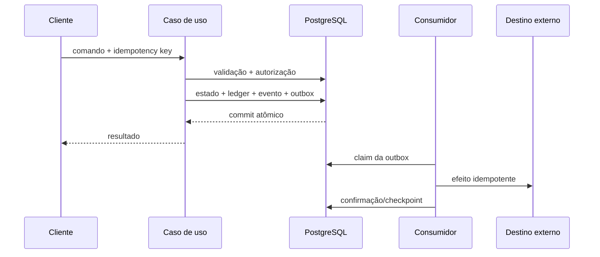

Detalhes: [`TRANSACTIONAL_OUTBOX.md`](TRANSACTIONAL_OUTBOX.md), [`QUEUE_ARCHITECTURE.md`](QUEUE_ARCHITECTURE.md) e [`RECONCILIATION_AND_RECOVERY.md`](RECONCILIATION_AND_RECOVERY.md).

## 9. Storage e arquivos

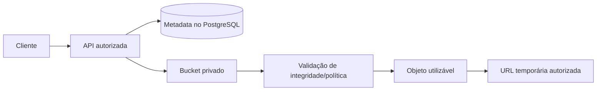

Objetos são privados; URLs assinadas são temporárias e não viram identificadores permanentes de domínio.

## 10. Ambientes

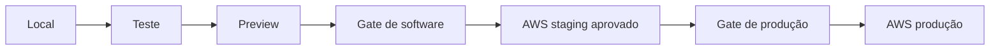

Supabase e Vercel servem desenvolvimento, teste e preview. A produção institucional depende da arquitetura AWS aprovada e dos critérios em [`../security/PRODUCTION_READINESS_GATE.md`](../security/PRODUCTION_READINESS_GATE.md).

## 11. Observabilidade e recuperação

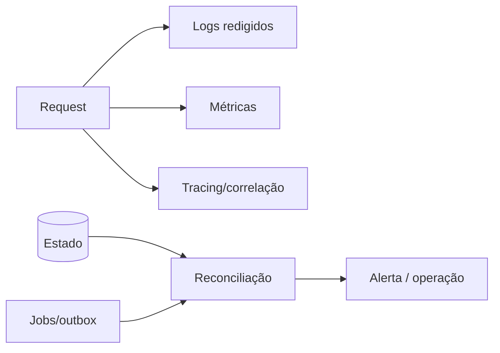

Logs técnicos não são eventos comportamentais. Backups, restore, rollback, replay e reconciliação têm contratos separados.

## 12. Mapa de documentos arquiteturais

- ambientes: [`ENVIRONMENT_AND_CLOUD_STRATEGY.md`](ENVIRONMENT_AND_CLOUD_STRATEGY.md);
- fronteira AWS: [`AWS_ARCHITECTURE_STATUS.md`](AWS_ARCHITECTURE_STATUS.md);
- providers: [`PROVIDER_PORTS_AND_ADAPTERS.md`](PROVIDER_PORTS_AND_ADAPTERS.md);
- banco: [`../data/database/DATABASE_MODEL.md`](../data/database/DATABASE_MODEL.md);
- dados ponta a ponta: [`../dataflows/DATA_FLOW_ARCHITECTURE.md`](../dataflows/DATA_FLOW_ARCHITECTURE.md);
- eventos: [`../events/EVENT_ARCHITECTURE.md`](../events/EVENT_ARCHITECTURE.md);
- storage: [`STORAGE_ARCHITECTURE.md`](STORAGE_ARCHITECTURE.md);
- segurança: [`../security/SECURITY_PRIVACY_ARCHITECTURE.md`](../security/SECURITY_PRIVACY_ARCHITECTURE.md);
- observabilidade: [`OBSERVABILITY_AND_ALERTS.md`](OBSERVABILITY_AND_ALERTS.md);
- recuperação: [`RECONCILIATION_AND_RECOVERY.md`](RECONCILIATION_AND_RECOVERY.md).
