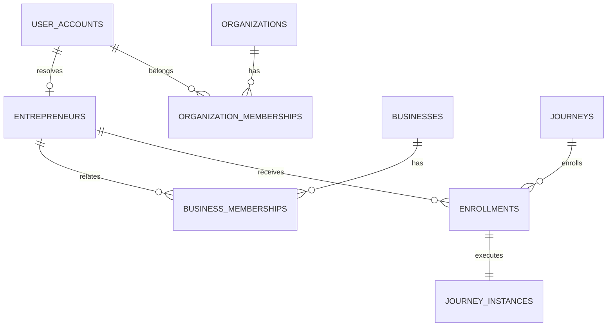
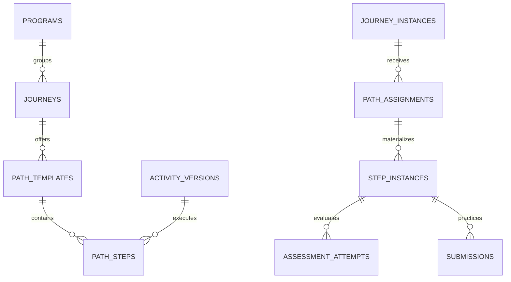
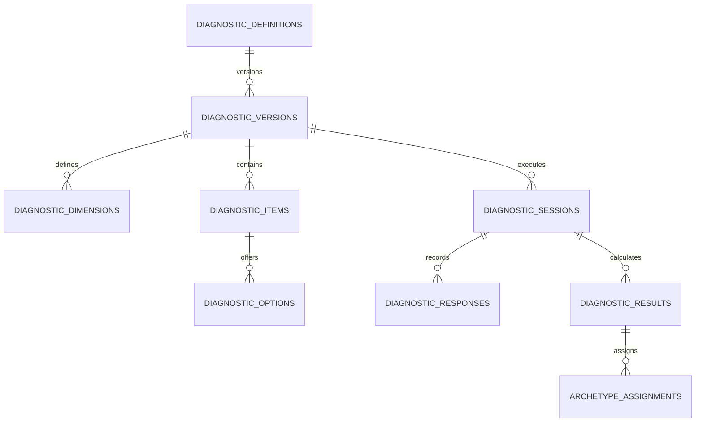
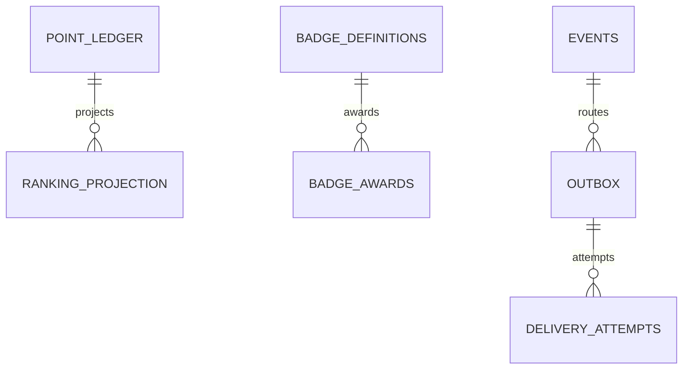

# ERD lógico — Plataforma Estímulo

**Revisado em:** 2026-09-01  
**Status:** visão conceitual vigente; migrations são a fonte física

## Identidade e participação

`JOURNEYS` representa conceitualmente a linha operacional atualmente armazenada em `catalog.journey_versions`, ligada 1:1 à definição. O nome físico legado não implica snapshots editoriais.

## Jornada e aprendizagem

## Diagnóstico

## Engajamento e integração

Diagramas omitem relações auxiliares para legibilidade. Para nomes/colunas/FKs exatos, consulte `supabase/migrations/` e o catálogo reconstruído nos database gates.