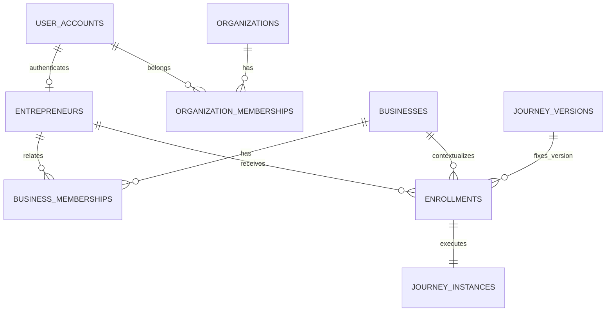
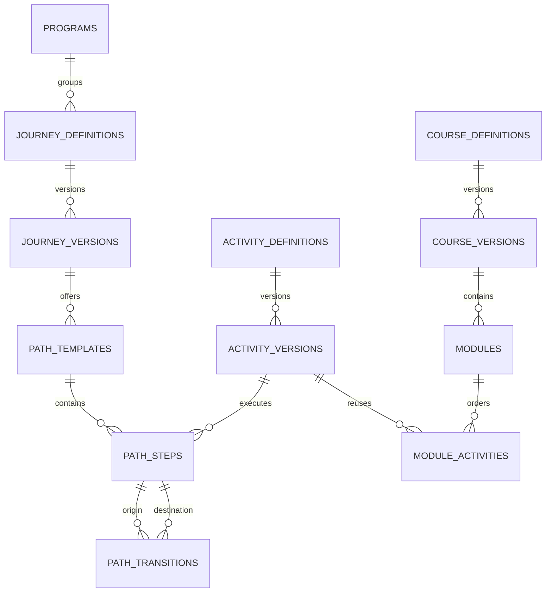
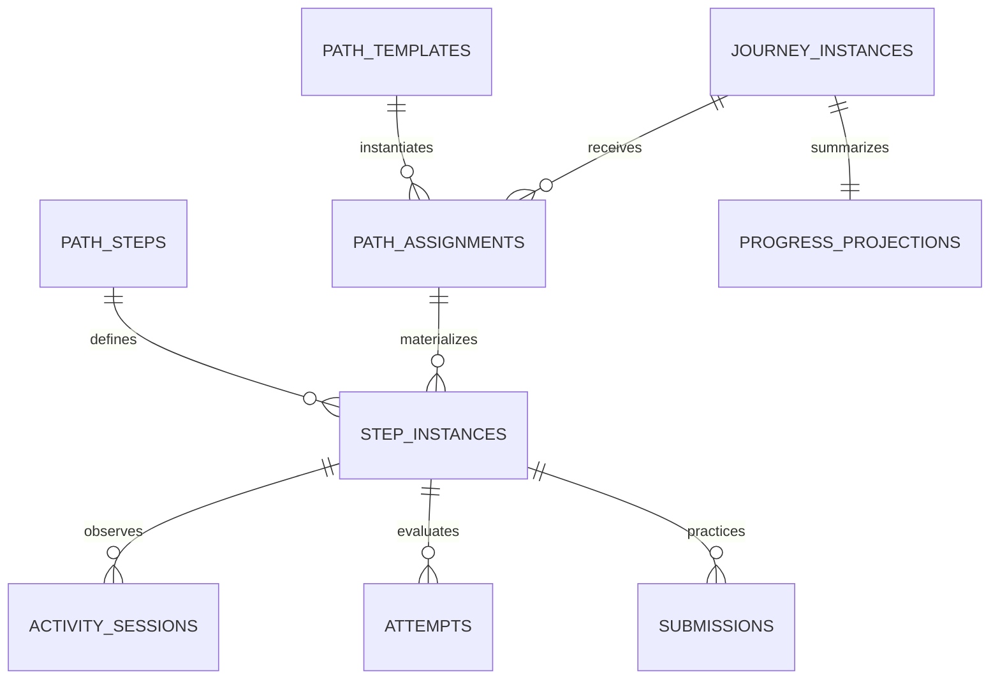
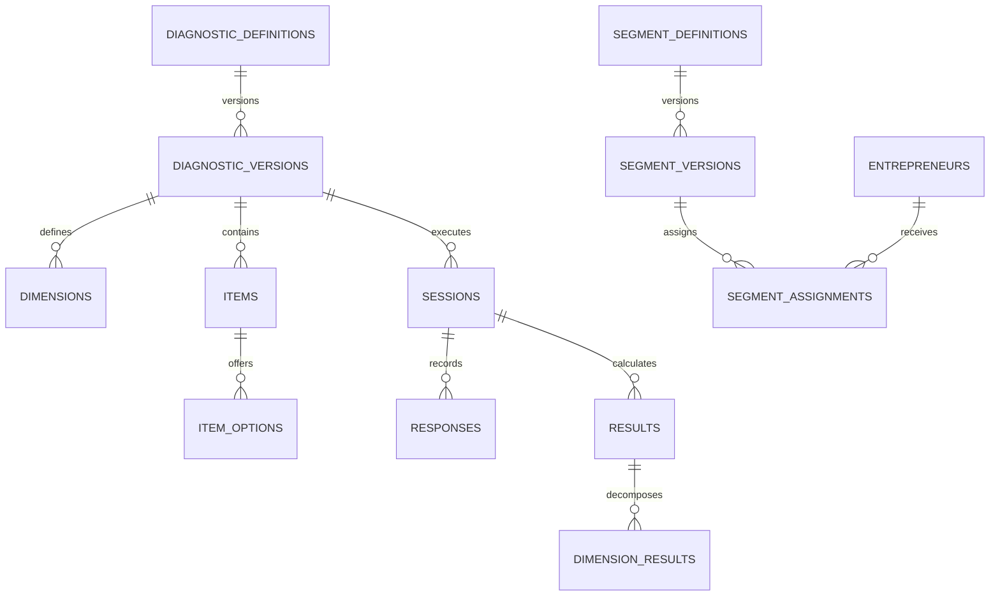
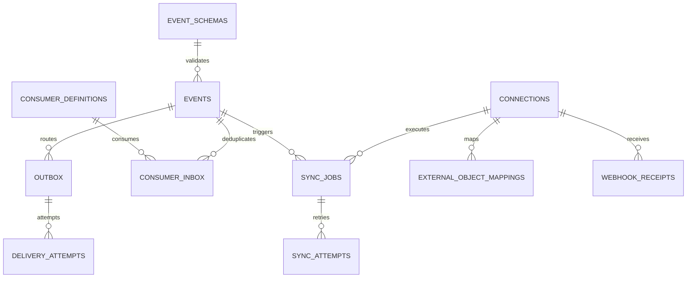
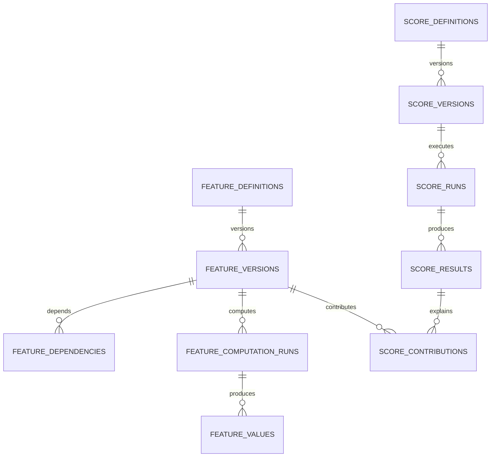

# ERD lógico — Plataforma Estímulo

**Versão:** 0.1  
**Status:** visão resumida; o dicionário contém as 121 tabelas.

## 1. Identidade e participação

## 2. Catálogo e orquestração

## 3. Execução da jornada

## 4. Diagnóstico e personalização

## 5. Eventos e integrações

## 6. Inteligência comportamental

## 7. Regra de leitura

Diagramas resumidos omitem relações auxiliares, auditoria e FKs de eventos para preservar legibilidade. A fonte completa é `database-model-v0.1.yaml`.
