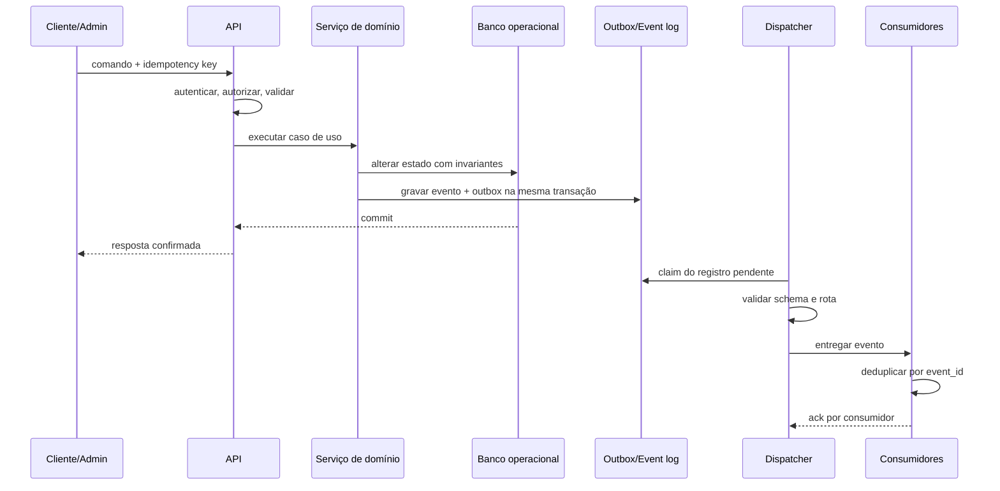
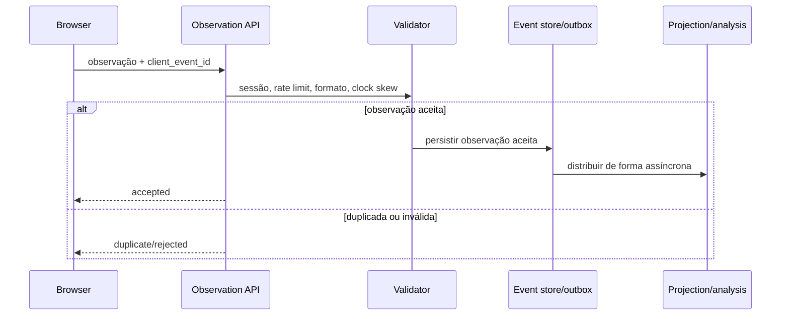
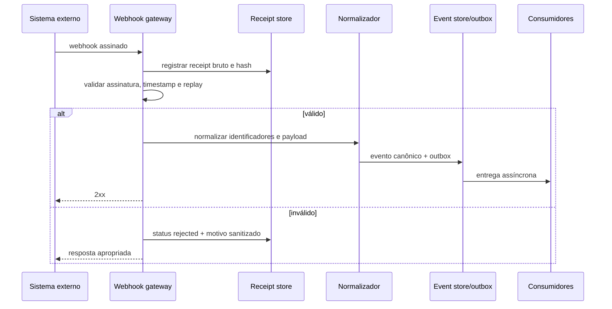
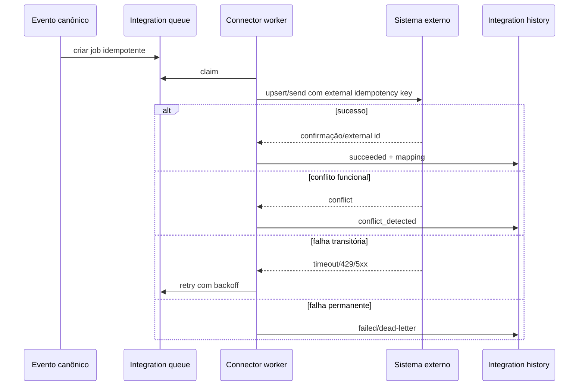

# Arquitetura de fluxos de dados ponta a ponta

**Versão:** 0.1  
**Data:** 2026-07-08  
**Status:** Baseline lógica para produção — E09

## 1. Objetivo

Definir como comandos, observações, eventos, projeções, integrações e dados analíticos percorrem a plataforma SaaS/LMS multi-jornada da Estímulo, da origem ao destino, incluindo estados intermediários, garantias, falhas e reconciliação.

Este documento não escolhe ainda a tecnologia física de fila, worker, banco ou nuvem. Essas decisões pertencem ao E10 e ao E12. A arquitetura lógica, entretanto, é obrigatória e independente da tecnologia escolhida.

## 2. Princípios obrigatórios

1. O estado operacional e o evento canônico correspondente devem ser confirmados na mesma transação lógica.
2. O cliente nunca declara fatos críticos como conclusão, aprovação, pontuação ou certificado.
3. Eventos são entregues pelo menos uma vez; consumidores devem ser idempotentes.
4. Não há consistência síncrona garantida com HubSpot ou outros sistemas externos.
5. O event store preserva fatos; projeções podem ser reconstruídas; efeitos externos não são repetidos em replay por padrão.
6. Dados pessoais diretos permanecem em stores protegidos e são referenciados por IDs opacos nos eventos.
7. Toda transformação relevante deve preservar linhagem entre origem, evento, projeção, feature e destino externo.
8. A mesma arquitetura deve servir à Jornada OpenAI e a qualquer jornada futura.

## 3. Componentes lógicos

```text
Browser / Admin UI / External system
                ↓
API / Command boundary / Webhook gateway
                ↓
Authentication + authorization + validation
                ↓
Domain service and transaction
  ├── operational state
  ├── canonical event record
  └── transactional outbox
                ↓ commit
Outbox dispatcher
  ├── schema validation
  ├── routing
  ├── retry/backoff
  └── dead-letter handling
                ↓
Consumer inboxes
  ├── operational projections
  ├── journey orchestration
  ├── intervention engine
  ├── gamification/credentials
  ├── HubSpot connector
  ├── feature pipeline
  └── research/analytics
                ↓
Reconciliation + monitoring + audit
```

## 4. Stores lógicos

| Store lógico | Finalidade | Mutabilidade | Fonte de verdade |
|---|---|---|---|
| Identity store | Conta, empreendedor, negócio, vínculos e IDs externos | Mutável com histórico/auditoria | Identidade interna |
| Operational domain store | Estado atual de jornadas, atividades, avaliações, práticas e intervenções | Mutável com invariantes | Estado operacional do produto |
| Canonical event store | Fatos canônicos imutáveis | Append-only | História dos eventos canônicos |
| Transactional outbox | Eventos aguardando distribuição | Status mutável; payload imutável | Entrega pendente |
| Consumer inbox | Deduplicação e checkpoint por consumidor | Mutável | Processamento de cada consumidor |
| Projection store | Visões derivadas para interface e operação | Reconstruível | Não é fonte primária |
| Object storage | Arquivos e evidências | Versionado e protegido | Conteúdo binário autorizado |
| Integration store | Jobs, mapeamentos, webhooks, conflitos e reconciliações | Mutável com histórico | Estado das integrações |
| Feature store | Features versionadas e resultados de cálculo | Append/versionado | Camada comportamental derivada |
| Score store | Definições, execuções e explicações experimentais | Append/versionado | Resultado derivado, nunca fato bruto |
| Audit/security store | Ações privilegiadas e eventos de segurança | Append-only/restrito | Auditoria e segurança |

## 5. Padrões de fluxo

### 5.1 Transação interna de domínio

Usada para publicação, inscrição, conclusão validada, submissão, concessão de pontos e outros fatos produzidos pelo servidor.



### 5.2 Observação do cliente

Usada para progresso de mídia, abertura de ativo ou visualização. A observação não altera automaticamente um estado crítico.



Regras: `occurred_at` do cliente é auxiliar; `received_at` do servidor é a referência operacional. Uma regra de conclusão pode consumir observações aceitas, mas somente o backend emite `learning.activity.completed`.

### 5.3 Webhook externo de entrada



O payload bruto permanece isolado, com retenção curta e acesso restrito. Apenas campos necessários são promovidos ao evento canônico.

### 5.4 Efeito externo assíncrono

Usado para HubSpot, notificações e futuros sistemas de crédito.



## 6. Unidade atômica de escrita

Para uma ação interna válida, a transação lógica contém:

1. atualização ou inserção do agregado operacional;
2. incremento de `aggregate_version` quando aplicável;
3. inserção do evento canônico imutável;
4. inserção do registro de outbox;
5. metadados de auditoria mínimos.

Se qualquer passo falhar, nenhum deles é confirmado. O response HTTP só confirma sucesso depois do commit.

## 7. Estados intermediários

### 7.1 Outbox

```text
pending → claimed → dispatched → completed
                  ↘ retry_wait → claimed
                  ↘ dead_letter
```

### 7.2 Entrega por consumidor

```text
pending → processing → succeeded
                     ↘ retry_wait → processing
                     ↘ skipped
                     ↘ dead_letter
```

### 7.3 Webhook recebido

```text
received → validated → normalized → processed
        ↘ rejected
        ↘ duplicate
        ↘ reconciliation_required
```

### 7.4 Job de integração

```text
queued → sending → succeeded
               ↘ retry_wait → sending
               ↘ conflict → reconciled
               ↘ failed_permanent
```

## 8. Consistência

| Relação | Modelo de consistência |
|---|---|
| Estado operacional + evento/outbox | Forte/atômico dentro da transação |
| Event store → projeções internas | Eventual, monitorada por lag |
| Plataforma → HubSpot | Eventual e reconciliável |
| Plataforma → notificações | Eventual, com confirmação do provedor quando disponível |
| Sistema de crédito → plataforma | Eventual, dependente da fonte oficial futura |
| Eventos → features | Batch ou streaming versionado; não altera fatos brutos |
| Features → score experimental | Derivado e reproduzível por versão |

## 9. Correlação e causalidade

- `correlation_id`: agrupa toda a jornada técnica de uma operação ou fluxo.
- `causation_id`: aponta para o comando ou evento que causou o novo fato.
- `event_id`: identifica unicamente o fato.
- `aggregate_id` + `aggregate_version`: controla ordem local.
- `traceparent`: conecta logs e traces, sem substituir os IDs de domínio.

Exemplo:

```text
assessment.attempt.submitted
  └─causa→ assessment.attempt.scored
              ├─causa→ assessment.attempt.passed
              ├─causa→ engagement.points.awarded
              └─causa→ journey.step.unblocked
```

## 10. Separação de dados

- Evento contém IDs, códigos versionados e metadados mínimos.
- Respostas livres, arquivos e dados identificáveis permanecem no store de domínio apropriado.
- O evento referencia `submission_id`, `evidence_id` ou `response_id`, não o conteúdo.
- URLs assinadas nunca são gravadas no event store.
- Logs e dead letters armazenam motivos sanitizados, não payloads pessoais indiscriminadamente.

## 11. Observabilidade mínima

Métricas obrigatórias:

- taxa de comandos por caso de uso;
- erros de validação, autorização e domínio;
- idade do registro mais antigo no outbox;
- lag por consumidor;
- taxa de retry;
- quantidade e idade de dead letters;
- duplicatas detectadas;
- gaps de `aggregate_version`;
- falhas e conflitos por integração;
- divergências encontradas pela reconciliação;
- tempo do evento até projeção e até destino externo.

Todo evento e job deve ser pesquisável por `event_id`, `correlation_id`, `aggregate_id` e, quando permitido, `entrepreneur_id` pseudônimo.

## 12. Limites desta etapa

O E09 define o caminho lógico completo. Permanecem para etapas seguintes:

- tabelas e índices físicos: E10;
- escolha de Postgres, fila, scheduler, workers e hosting: E12;
- propriedades e objetos reais do HubSpot: E11;
- estados oficiais e fonte do crédito: dependência interna;
- SLOs finais, retenção e runbooks operacionais: E13.
