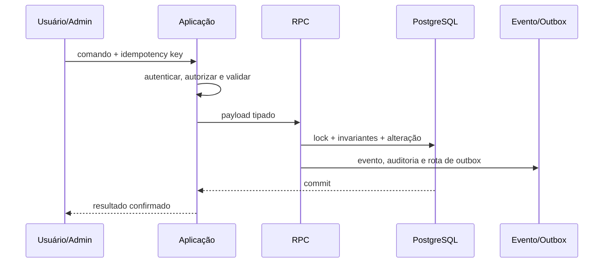
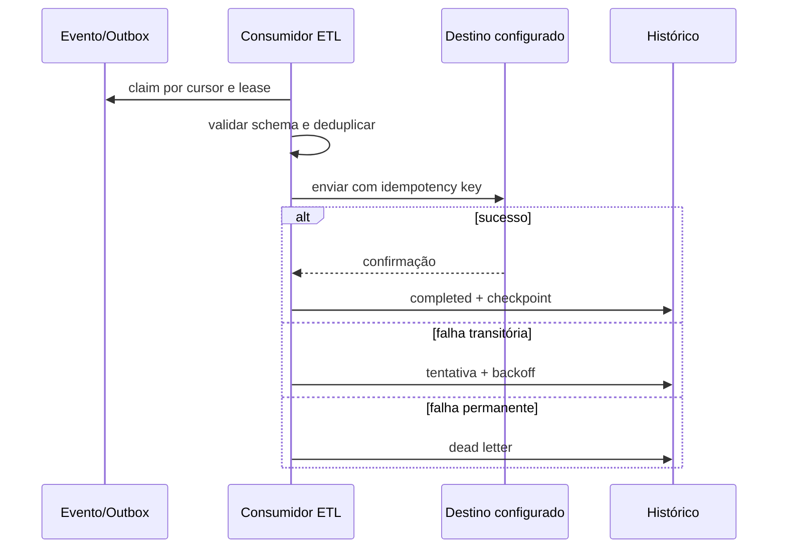

# Arquitetura de fluxos de dados ponta a ponta

**Revisado em:** 2026-07-31  
**Status:** contrato lógico implementado em desenvolvimento, teste e preview; operação AWS pendente

## 1. Objetivo

Definir como comandos, observações, eventos, projeções, arquivos, avaliações por IA e exportações percorrem a Plataforma Estímulo, preservando atomicidade, idempotência, autorização, linhagem e recuperação.

## 2. Princípios

1. Estado operacional, ledger, evento e outbox pertencentes ao mesmo fato são confirmados na mesma transação.
2. O cliente não declara conclusão, nota final, pontuação, acesso ou entrega concluída.
3. Eventos podem ser entregues pelo menos uma vez; consumidores são idempotentes.
4. PostgreSQL é a fonte operacional. Destinos ETL são assíncronos, substituíveis e reconciliáveis.
5. Replay reconstrói projeções internas, mas não repete efeitos externos automaticamente.
6. Dados pessoais e arquivos permanecem em stores protegidos; eventos usam IDs e metadados mínimos.
7. Score comportamental é derivado e exclusivamente analítico.
8. Diagnóstico opcional não altera arquétipo nem elegibilidade de jornadas.

## 3. Componentes

```text
Browser / Admin UI / link rastreável
                ↓
Route / Server Action / API autenticada
                ↓
Autenticação + autorização + validação + idempotência
                ↓
RPC / serviço de domínio / transação PostgreSQL
  ├── estado operacional
  ├── ledger ou histórico versionado
  ├── evento canônico
  ├── auditoria
  └── outbox transacional
                ↓ commit
Leitores e consumidores
  ├── projeções da aplicação
  ├── orquestração de jornadas
  ├── recompensas e certificados
  ├── avaliação por IA
  ├── features e score analítico
  └── consumidor ETL futuro
                ↓
Reconciliação + métricas + auditoria
```

## 4. Stores lógicos

| Store | Responsabilidade |
|---|---|
| Identidade | conta, empreendedor, negócio e vínculos organizacionais |
| Catálogo | jornadas, atividades, biblioteca, temas e versões editoriais |
| Operacional | inscrições, passos, entregas, diagnósticos, páginas B2B e resgates |
| Ledgers | pontos de engajamento, carteira de recompensa e compensações |
| Event store | fatos canônicos imutáveis |
| Outbox | distribuição pendente por rota e cursor |
| Inbox | deduplicação e checkpoint de consumidores |
| Storage | templates, arquivos de biblioteca e evidências de entrega |
| Inteligência | avaliações de IA, features e snapshots de score |
| Governança | documentos legais, aceites, auditoria, retenção e linhagem |

## 5. Fluxos implementados

### 5.1 Comando transacional



Usos: publicação, aceite legal, conversão de pontos, resgate/cancelamento, entrega, diagnóstico e concessão B2B.

### 5.2 Observação comportamental

O browser envia `event_id`, `interaction_type`, entidade, sessão, horário e propriedades para `/api/behavior-events`. O servidor valida origem, tamanho e identidade e grava o evento por RPC idempotente. A observação não altera acesso ou estado crítico.

### 5.3 Link UTM

```text
/r/<slug>
  → valida campanha, público, período e limite
  → registra visita anônima e token com hash
  → preserva UTMs, parâmetros, referenciador e dispositivo
  → autenticação/cadastro
  → associa visita ao usuário
  → registra first touch, last touch, signup e conversion
  → resolve destino pós-login
  → aplica autorização normal da rota
```

### 5.4 Entrega e IA

```text
formulário participante
  → validação de origem e arquivos
  → storage privado
  → delivery_submit transacional
  → processamento de extração/análise
  → avaliador por IA
  → automática ou aguardando revisão humana
  → aprovação/ajuste administrativo
  → nota, feedback, auditoria e pontos configurados
```

Arquivos executáveis não são executados. Falha no upload remove objetos criados naquela tentativa. Falha da IA preserva a entrega e solicita revisão humana.

### 5.5 Efeito externo por ETL



O destino não aparece no código do produtor. `ETL_EXPORT_ENABLED=false` mantém o consumo externo desligado por padrão.

## 6. Unidades atômicas relevantes

### Recompensas

- lock da carteira e da recompensa;
- validação de saldo, estoque, período e limite;
- débito no ledger e redução de estoque;
- criação do resgate;
- cancelamento compensatório com devolução de saldo e estoque.

### Publicação

- validação da versão rascunho;
- retirada da versão publicada anterior;
- publicação da nova versão;
- atualização das referências dependentes quando aplicável;
- evento e auditoria.

### B2B

- versão publicada e dentro do período;
- concessão direta ou associação a grupo;
- filtro no servidor antes de devolver a página;
- nenhuma confiança em ocultação apenas visual.

## 7. Estados intermediários

### Outbox

```text
pending → claimed → completed
              ↘ retry_wait → claimed
              ↘ dead_letter
```

### Entrega

```text
not_started → submitted → processing → graded
                          ↘ awaiting_human_review → graded
                          ↘ returned_for_revision
```

### Resgate

```text
pending → approved → preparing → sent/available → delivered
       ↘ cancelled → refunded
```

### Diagnóstico opcional

```text
available → in_progress → completed
                     ↘ expired/abandoned
```

## 8. Consistência

| Relação | Modelo |
|---|---|
| estado + ledger + evento/outbox | forte na transação |
| outbox → projeção/consumidor | eventual e monitorada |
| plataforma → destino ETL | eventual, idempotente e reconciliável |
| entrega → avaliação de IA | eventual, com estado visível |
| eventos → score | derivado, versionado e recalculável |
| UTM anônimo → usuário | eventual após autenticação, preservando histórico |

## 9. Correlação e linhagem

- `event_id`: fato único;
- `idempotency_key`: repetição segura do comando;
- `correlation_id`: fluxo técnico completo;
- `causation_id`: comando ou evento causal;
- `aggregate_id` e `aggregate_version`: ordem local;
- hash de payload/input: integridade e recalculabilidade;
- cursor/checkpoint: posição do consumidor ETL.

## 10. Privacidade e segurança

- URLs assinadas, segredos e conteúdo binário não entram no event store.
- Payloads comportamentais têm tamanho limitado e propriedades estruturadas.
- Evidências ficam em buckets privados.
- CPF possui criptografia e lookup HMAC independentes.
- RPCs públicas de comando não são executáveis por `anon` ou `authenticated`; o gateway autenticado usa identidade validada.
- Logs e dead letters guardam códigos e contexto sanitizado, não conteúdo pessoal indiscriminado.

## 11. Observabilidade

Métricas mínimas:

- comandos por caso de uso e resultado;
- falhas de autenticação, autorização e validação;
- idade e volume do outbox;
- tentativas, retries e dead letters;
- latência de avaliação por IA e taxa de revisão humana;
- conversões e resgates sem expor dados pessoais;
- eventos aceitos, rejeitados e duplicados;
- cobertura e confiança do score;
- divergências encontradas pela reconciliação ETL.

## 12. Limites

A camada lógica e o runtime Supabase de desenvolvimento/teste estão implementados. Worker ETL, filas, armazenamento, identidade de workload, observabilidade e continuidade definitivos de produção dependem da arquitetura AWS aprovada.
