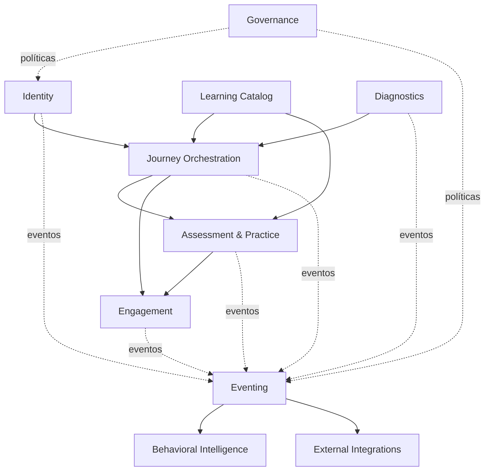

# Contextos delimitados e dependências modulares

**Versão:** 1.0  
**Revisado em:** 2026-09-01  
**Status:** fronteiras conceituais alinhadas ao monólito modular vigente

Os contextos são fronteiras lógicas, não microserviços. O código pode compartilhar o mesmo deploy e PostgreSQL, mas cada capacidade deve manter ownership claro e dependências testáveis.

## Contextos

### Identity & Organizations

Conta, empreendedor, negócio, organizações, memberships, papéis, permissões e vínculo de identidades externas. Não possui progresso ou conteúdo.

### Learning Catalog

Programas, jornada, trilhas, conteúdos, cursos, atividades, ativos e taxonomia. Para **jornada**, o contrato vigente é entidade operacional única `draft ↔ published`; nomes físicos `JourneyVersion`/`journey_version_id` são compatibilidade do banco. Outras capacidades podem continuar versionadas quando o runtime exige snapshot.

### Journey Orchestration

Elegibilidade, matrícula, instância, atribuição de trilha, progressão e conclusão. Consome a jornada publicada atual e registra fatos de execução sem editar o catálogo.

### Diagnostics & Personalization

Definições/versões de diagnóstico, dimensões, perguntas, respostas, resultados e atribuições de arquétipo. Diagnóstico opcional não altera arquétipo principal. Não decide crédito.

### Assessment & Practice

Avaliações, quick checks, tentativas, entregas, rubricas e revisões. Múltipla escolha usa igualdade exata do conjunto de alternativas corretas.

### Engagement, Gamification & Credentials

Ledger de pontos, ranking, recompensas, badges e certificados. Awards são fatos; a UI não fabrica aquisição a partir de simples visita ao browser.

### Interventions

Definições, regras de elegibilidade/supressão e entrega de intervenções autorizadas.

### Behavioral Eventing

Eventos, outbox, idempotência, ordenação, replay e dead-letter. Não absorve regras de negócio dos outros contextos.

### Behavioral Intelligence

Features e scores analíticos versionados. Não escreve políticas de acesso, jornada, recompensa ou crédito.

### External Integrations

Adapters, mapeamentos, consumidores, webhooks e reconciliação. Produtores publicam para outbox neutra; nenhum SDK/CRM é dependência do núcleo. HubSpot é um destino possível sujeito à `DEC-070`, não uma fonte transacional do LMS.

### Governance & Audit

Documentos legais, aceites, retenção, privacidade, auditoria e políticas transversais.

## Dependências

## Regras

1. Catálogo não conhece participantes.
2. Orquestração não edita conteúdo.
3. Assessment emite fatos; gamificação decide lançamento conforme regra idempotente.
4. Integração externa traduz/projeta fatos; não redefine identidade interna.
5. Eventos não substituem transações locais que exigem consistência imediata.
6. Administração compõe casos de uso; não escreve tabelas diretamente.
7. Dependências permitidas do código são verificadas por `config/module-boundaries.json`.

Consulte [`DOMAIN_MODEL.md`](DOMAIN_MODEL.md) e [`../implementation/APPLICATION_FOUNDATION.md`](../implementation/APPLICATION_FOUNDATION.md).