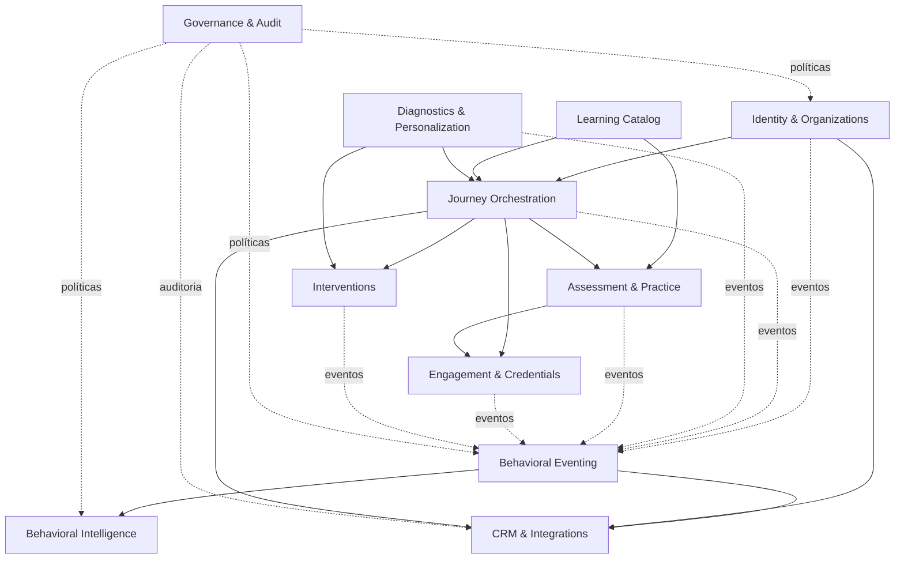

# Contextos delimitados e dependências modulares

**Versão:** 0.1  
**Data:** 2026-07-08  
**Status:** Proposta técnica  
**Escopo:** E05-T02

## 1. Direção arquitetural

A aplicação deve começar como **monólito modular**. Os contextos abaixo são fronteiras lógicas e de propriedade do domínio, não microserviços. Eles podem compartilhar o mesmo deploy e PostgreSQL, desde que:

- cada módulo possua casos de uso e modelo próprios;
- escrita entre contextos ocorra por interfaces explícitas ou eventos;
- um módulo não altere diretamente tabelas pertencentes a outro;
- dependências sejam unidirecionais e testáveis;
- integrações externas permaneçam na borda da aplicação.

## 2. Contextos propostos

### BC-01 — Identity & Organizations

**Responsabilidade**

- contas, autenticação e sessão;
- empreendedor e negócio;
- vínculos pessoa–negócio;
- organizações operadoras;
- papéis, capacidades e identidades externas.

**Possui**

- `UserAccount`;
- `Entrepreneur`;
- `Business`;
- `BusinessMembership`;
- `Organization`;
- `OrganizationMembership`;
- `ExternalIdentity`.

**Não possui**

- progresso;
- jornadas;
- score;
- conteúdo.

### BC-02 — Learning Catalog

**Responsabilidade**

- programa;
- definições e versões de jornadas e cursos;
- módulos;
- atividades e ativos;
- fluxo editorial e publicação.

**Possui**

- `Program`;
- `JourneyDefinition` / `JourneyVersion`;
- `CourseDefinition` / `CourseVersion`;
- `Module`;
- `ActivityDefinition` / `ActivityVersion`;
- `ContentAsset`.

**Não possui**

- participação individual;
- respostas e tentativas;
- cálculo de score.

### BC-03 — Journey Orchestration

**Responsabilidade**

- elegibilidade e inscrição;
- atribuição de trilha;
- instâncias de atividade;
- disponibilidade, progressão e conclusão;
- coortes e pilotos.

**Possui**

- `Cohort`;
- `JourneyParticipation`;
- `PathAssignment`;
- `ActivityInstance`;
- `ProgressProjection`;
- `AssignmentPolicy` e registros de decisão.

**Consome**

- versões publicadas do catálogo;
- resultados de diagnóstico;
- contexto de crédito autorizado.

### BC-04 — Diagnostics & Personalization

**Responsabilidade**

- instrumentos e dimensões;
- sessões e respostas;
- cálculo e explicação do resultado;
- definições e atribuições de arquétipo;
- recomendação estruturada para personalização.

**Possui**

- `DiagnosticDefinition` / `DiagnosticVersion`;
- dimensões, perguntas e opções;
- `DiagnosticSession` / `DiagnosticResponse` / `DiagnosticResult`;
- `ArchetypeDefinition` / `ArchetypeVersion` / `ArchetypeAssignment`.

**Não decide** crédito.

### BC-05 — Assessment & Practice

**Responsabilidade**

- avaliações, itens e políticas de tentativa;
- tentativas, respostas e correção;
- atividades práticas, submissões e revisões.

**Possui**

- definições versionadas de avaliação;
- `AssessmentAttempt` e resultado;
- `PracticalSubmission`;
- `SubmissionReview`.

### BC-06 — Engagement, Gamification & Credentials

**Responsabilidade**

- regras de pontos;
- ledger;
- selos;
- sequências e níveis, se adotados;
- certificados e revogações.

**Possui**

- `PointRuleVersion`;
- `PointLedgerEntry`;
- `BadgeDefinition` / `BadgeAward`;
- `CertificateDefinition` / `CertificateIssuance`.

**Regra:** consome fatos verificáveis; não interpreta cliques arbitrários como conquista.

### BC-07 — Interventions

**Responsabilidade**

- definição de intervenções;
- regras de elegibilidade, frequência e supressão;
- criação, entrega e resultado;
- encaminhamento humano ou digital.

**Possui**

- `InterventionDefinition` / `InterventionVersion`;
- `InterventionRule`;
- `InterventionInstance`;
- `InterventionDelivery`.

### BC-08 — Behavioral Eventing

**Responsabilidade**

- contratos de evento;
- persistência imutável;
- outbox;
- idempotência, ordenação e correlação;
- processamento, replay e dead-letter.

**Possui**

- `EventSchema`;
- `CanonicalEvent`;
- `OutboxRecord`;
- `EventProcessingRecord`;
- `DeadLetterEvent`.

**Regra:** não concentra regras de negócio dos outros contextos; preserva e distribui fatos.

### BC-09 — Behavioral Intelligence

**Responsabilidade**

- definição e cálculo de features;
- definição e execução de scores experimentais;
- explicações, qualidade e validação;
- datasets analíticos pseudonimizados.

**Possui**

- `FeatureDefinition` / `FeatureVersion`;
- `FeatureComputationRun` / `FeatureValue`;
- `ScoreDefinition` / `ScoreVersion`;
- `ScoreRun` / `ScoreResult` / `ScoreExplanation`;
- `ScoreValidationResult`.

**Regra:** não escreve em decisões de crédito na release inicial de produção.

### BC-10 — CRM & External Integrations

**Responsabilidade**

- HubSpot e sistemas futuros;
- mapeamento de objetos e campos;
- comandos de sincronização;
- webhooks;
- retry, conflito e reconciliação.

**Possui**

- `IntegrationConnection`;
- `ExternalObjectMapping`;
- `SyncCommand`;
- `SyncAttempt`;
- `WebhookReceipt`;
- `ReconciliationIssue`.

**Regra:** nenhum SDK externo aparece no núcleo dos módulos de domínio.

### BC-11 — Governance & Audit

**Responsabilidade**

- consentimentos e preferências;
- solicitações de privacidade;
- retenção e anonimização;
- auditoria administrativa;
- políticas de exportação e acesso analítico.

**Possui**

- `ConsentRecord`;
- `CommunicationPreference`;
- `PrivacyRequest`;
- `RetentionPolicy`;
- `AdministrativeAuditRecord`;
- `DataLineageRecord` quando não pertencente ao contexto analítico.

## 3. Mapa de dependências



## 4. Regras de dependência

1. `Learning Catalog` não conhece participantes.
2. `Journey Orchestration` referencia IDs/versionamentos do catálogo; não edita conteúdo.
3. `Assessment & Practice` não concede pontos diretamente; emite fatos que o contexto de gamificação consome.
4. `Behavioral Intelligence` não consulta tabelas internas arbitrariamente sem um contrato de dados/linhagem.
5. `CRM & External Integrations` traduz o modelo interno para o externo; o domínio não utiliza IDs do HubSpot como identidade principal.
6. `Governance & Audit` define políticas transversais, mas regras de negócio continuam em seus contextos.
7. Eventos não substituem transações locais que exigem consistência imediata; outbox conecta as duas necessidades.
8. A interface administrativa chama casos de uso dos contextos; não escreve diretamente no banco.

## 5. Estrutura de módulos sugerida

```text
src/
  modules/
    identity/
    organizations/
    learning-catalog/
    journey-orchestration/
    diagnostics/
    assessments/
    practical-activities/
    engagement/
    interventions/
    behavioral-events/
    behavioral-intelligence/
    integrations/
      hubspot/
    governance/
  shared/
    kernel/
    database/
    observability/
    validation/
```

A divisão exata entre `identity` e `organizations`, ou entre `assessments` e `practical-activities`, pode ser consolidada no código inicial. As fronteiras conceituais devem permanecer.

## 6. Dados compartilhados e projeções

Evitar uma tabela universal usada por todos os módulos. Quando outro contexto precisar de informação:

- utilizar uma interface de leitura;
- consumir evento e manter projeção local;
- utilizar view/read model controlado;
- usar consulta coordenada na camada de aplicação quando a consistência imediata for necessária.

## 7. Administração não é um contexto delimitado

`Admin` é uma composição de casos de uso:

- publicar jornada — Learning Catalog;
- acompanhar participação — Journey Orchestration;
- revisar prática — Assessment & Practice;
- reprocessar HubSpot — Integrations;
- consultar eventos — Behavioral Eventing;
- autorizar exportação — Governance.

Isso evita criar um segundo conjunto de regras administrativas paralelo ao domínio real.

## 8. Pendências para o modelo lógico

- decidir uso de schemas PostgreSQL por contexto ou apenas convenção de módulos;
- definir estratégia de leitura entre contextos no monólito;
- escolher biblioteca/abordagem para transações e outbox;
- validar limites operacionais do HubSpot;
- confirmar quais papéis entram na release inicial de produção;
- confirmar se o contexto de crédito será apenas externo ou terá uma projeção local.
