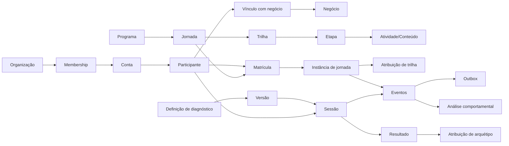

# Modelo de domínio da Plataforma Estímulo

## Princípios

1. conta de acesso, participante, negócio e organização são conceitos distintos;
2. programa, jornada, trilha, etapa, atividade e conteúdo possuem responsabilidades próprias;
3. jornada é uma entidade operacional única com estado `draft` ou `published`;
4. nomes físicos legados como `journey_version_id` são compatibilidade do schema, não conceito editorial;
5. diagnóstico, documentos legais, avaliações e outras capacidades versionadas preservam a versão aplicável;
6. eventos, ledgers, aceites, resultados, submissões e auditoria preservam fatos históricos;
7. arquétipo e score comportamental não são atributos cadastrais permanentes e não decidem crédito;
8. administração usa os mesmos casos de uso autorizados do domínio;
9. integrações externas ficam na borda e consomem outbox.

## Mapa conceitual



## Identidade e organizações

- `UserAccount`: identidade autenticável e estado da conta;
- `Entrepreneur`: pessoa participante, separada da credencial;
- `Business`: negócio beneficiário;
- `BusinessMembership`: relação temporal pessoa–negócio;
- `Organization`: organização operadora/parceira;
- `OrganizationMembership`: vínculo que fornece escopo organizacional e RBAC;
- identificadores externos nunca substituem UUIDs internos.

A administração exige identidade federada válida, identidade interna, membership Estímulo e capabilities RBAC. Domínio de e-mail sozinho não autoriza acesso.

## Catálogo e jornada

### Programa

Agrupa jornadas e objetivos relacionados sem controlar a execução individual.

### Jornada

É a unidade longitudinal administrável:

```text
draft <-> published
```

- `draft`: editável e indisponível ao participante;
- `published`: disponível e editável conforme autorização;
- despublicar retorna o mesmo registro a `draft`;
- fatos já registrados permanecem em seus stores próprios.

O schema pode manter estruturas físicas com nomes `journey_definitions`/`journey_versions` por compatibilidade 1:1. Isso não cria histórico editorial navegável no produto.

### Trilha, etapa e atividade

Trilhas organizam etapas e critérios de progressão. Atividades representam conteúdo, avaliação, prática, pesquisa, reflexão, sessão ao vivo ou recurso externo conforme o tipo suportado.

## Diagnóstico

Diagnóstico usa definição–versão–instância para tornar cada resultado reproduzível. O principal pode atribuir arquétipo; diagnósticos opcionais mantêm resultados separados. O runtime executa configuração publicada e não inventa metodologia.

## Avaliação e prática

Tentativas e submissões preservam resposta enviada, instrumento/regra aplicável e revisão. Quick checks distinguem tipos de pergunta; múltipla escolha usa igualdade exata entre os conjuntos selecionado e correto.

## Gamificação e credenciais

- pontos vêm de ledger idempotente;
- saldo e ranking são projeções;
- badges são awards identificáveis;
- certificados preservam regra e evidência de emissão;
- identificação de terceiros é minimizada nas superfícies participantes.

## Eventos, análise e integração

Eventos representam fatos. Outbox desacopla efeitos externos. Features e score comportamental são analíticos e não alteram acesso, jornada, recompensa ou crédito por padrão.

## Governança

Documentos legais, aceites, retenção, direitos dos titulares e auditoria pertencem ao contexto de governança e preservam seus próprios históricos.