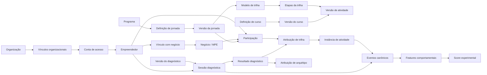

# Modelo de domínio da Plataforma Estímulo

**Versão:** 0.1  
**Data:** 2026-07-08  
**Status:** Proposta técnica para validação no Gate da fase inicial  
**Escopo:** E05-T01 — entidades, conceitos, relações e invariantes

## 1. Objetivo

Definir um vocabulário e uma estrutura de domínio independentes dos mockups, do schema existente e da Jornada OpenAI. O modelo precisa suportar o primeiro produto funcional e permitir novas jornadas, conteúdos, parceiros, regras e públicos sem duplicar tabelas ou inserir condições específicas da OpenAI no núcleo da aplicação.

Este documento é conceitual. Ele não define ainda nomes finais de tabelas, tecnologia de persistência ou contratos de API.

## 2. Princípios

1. **Identidade não é empresa.** Uma pessoa pode participar de mais de uma empresa e uma empresa pode ter mais de uma pessoa associada.
2. **Organização não é empresa beneficiária.** Estímulo, parceiros e produtores de conteúdo são organizações operadoras; MPEs atendidas são negócios beneficiários.
3. **Conteúdo não é jornada.** Conteúdos e cursos podem ser reutilizados; a jornada define quando, para quem e em qual ordem são usados.
4. **Definição não é execução.** Jornada publicada, diagnóstico e regra são definições versionadas; participação, sessão e tentativa são instâncias de execução.
5. **Publicação cria imutabilidade.** Versões publicadas não são alteradas silenciosamente.
6. **Estado atual não substitui histórico.** Projeções facilitam a aplicação, mas eventos e registros históricos preservam como o estado foi alcançado.
7. **Segmento, arquétipo e momento de crédito são conceitos diferentes.** Nenhum deles deve ser usado como sinônimo dos demais.
8. **Score é derivado, experimental e versionado.** Não pertence ao perfil principal do empreendedor nem altera crédito na release inicial de produção.
9. **Regras de jornada são dados estruturados.** Texto explicativo pode coexistir, mas não substitui regras executáveis.
10. **A administração é uma superfície da aplicação.** Ela opera os domínios; não é um domínio independente que duplica regras.

## 3. Mapa conceitual de alto nível

## 4. Identidade, pessoas e organizações

### 4.1 Conta de acesso (`UserAccount`)

Representa a identidade autenticável no provedor de autenticação.

**Responsabilidades**

- login, recuperação e segurança da sessão;
- associação a uma pessoa interna do domínio;
- status de acesso;
- autenticação multifator quando aplicável.

**Não deve conter**

- progresso educacional;
- arquétipo;
- score;
- dados de empresa além do necessário à autenticação.

### 4.2 Empreendedor (`Entrepreneur`)

Representa a pessoa participante das iniciativas da Estímulo. É a identidade de negócio da pessoa, separada da conta de autenticação.

**Regras**

- pode existir antes da criação de uma conta;
- pode possuir múltiplos identificadores externos;
- pode estar associado a múltiplos negócios ao longo do tempo;
- pode possuir múltiplas participações em programas e jornadas;
- dados pessoais devem ser minimizados e classificados.

### 4.3 Negócio (`Business`)

Representa a MPE, MEI, negócio informal ou outra unidade econômica atendida, conforme elegibilidade de cada iniciativa.

**Regras**

- não pressupõe CNPJ obrigatório para todos os usos futuros;
- pode ter vários empreendedores vinculados;
- mantém identificadores externos e atributos cadastrais;
- resultados de crédito e impacto pertencem ao negócio ou à operação correspondente, não à conta de acesso.

### 4.4 Vínculo com negócio (`BusinessMembership`)

Relaciona empreendedor e negócio.

**Atributos conceituais**

- função ou relação: sócio, representante, gestor, colaborador;
- período de validade;
- principal ou secundário;
- fonte e evidência da associação;
- status de verificação.

### 4.5 Organização (`Organization`)

Representa Estímulo, parceiros, produtores de conteúdo, instituições ou unidades que operam a plataforma.

**Não representa** o negócio beneficiário.

### 4.6 Vínculo organizacional (`OrganizationMembership`)

Relaciona uma conta de acesso a uma organização e a capacidades operacionais.

### 4.7 Identidade externa (`ExternalIdentity`)

Relaciona entidades internas a identificadores de sistemas externos, como HubSpot e sistemas de crédito.

**Invariante:** identificadores externos nunca são chave primária interna.

## 5. Catálogo educacional

### 5.1 Programa (`Program`)

Estrutura institucional de nível superior que agrupa jornadas relacionadas a um objetivo estratégico.

**Exemplo conceitual:** Capacitação de Crédito.

Um programa pode possuir:

- uma ou mais jornadas;
- segmentos elegíveis;
- políticas gerais;
- métricas e período de vigência;
- organização proprietária.

### 5.2 Definição de jornada (`JourneyDefinition`)

Identidade estável de uma jornada ao longo das suas versões.

**Exemplo inicial:** Capacitação em IA/OpenAI.

Contém apenas metadados estáveis, como código, proprietário e finalidade geral. A estrutura executável pertence à versão.

### 5.3 Versão da jornada (`JourneyVersion`)

Snapshot imutável depois da publicação, contendo:

- objetivos;
- competências;
- modelos de trilha;
- regras de entrada;
- políticas de atribuição;
- regras de progressão e conclusão;
- intervenções vinculadas;
- critérios de certificação;
- referências a versões de atividades e cursos.

**Invariante:** toda participação aponta para uma versão específica.

### 5.4 Definição de curso (`CourseDefinition`)

Identidade estável de uma unidade educacional reutilizável.

Curso é uma embalagem editorial; não controla sozinho a experiência longitudinal do participante.

### 5.5 Versão do curso (`CourseVersion`)

Snapshot publicado de um curso, contendo módulos e referências a atividades versionadas.

Uma mesma versão de curso pode ser usada em diferentes jornadas, desde que as regras da jornada permitam.

### 5.6 Módulo (`Module`)

Agrupamento editorial dentro de uma versão de curso. Não é, por si só, uma instância de execução.

### 5.7 Definição de atividade (`ActivityDefinition`)

Identidade estável de uma atividade reutilizável.

### 5.8 Versão de atividade (`ActivityVersion`)

Unidade executável referenciada por curso ou etapa de jornada.

**Tipos genéricos iniciais**

- conteúdo;
- avaliação;
- atividade prática;
- reflexão ou autorrelato;
- pesquisa;
- checkpoint;
- sessão ao vivo;
- link ou ferramenta externa.

Adicionar novo conteúdo de um tipo suportado não deve exigir código. Um tipo de atividade estruturalmente novo pode exigir um plugin/caso de uso novo, mas não uma tabela específica por jornada.

### 5.9 Ativo de conteúdo (`ContentAsset`)

Arquivo ou recurso associado a uma versão de atividade:

- vídeo;
- texto;
- áudio;
- legenda;
- slide;
- download;
- prompt;
- template;
- checklist;
- imagem;
- link externo.

Ativos possuem versão, status editorial, metadados de acessibilidade e regras de acesso.

## 6. Orquestração da jornada

### 6.1 Modelo de trilha (`PathTemplate`)

Caminho possível dentro de uma versão de jornada. Pode representar uma trilha padrão, personalizada ou adaptativa.

### 6.2 Etapa de trilha (`PathStep`)

Nó de execução em um modelo de trilha.

Uma etapa referencia uma versão de atividade e define:

- ordem ou dependências;
- obrigatoriedade;
- regra de disponibilidade;
- regra de conclusão;
- prazo;
- política de tentativa;
- recompensa aplicável;
- transições possíveis.

### 6.3 Transição (`PathTransition`)

Conecta etapas e contém predicados estruturados. Permite representar uma sequência, ramificação ou retorno sem codificar condições específicas da jornada.

### 6.4 Política de atribuição (`AssignmentPolicy`)

Regra versionada que decide qual jornada/trilha deve ser atribuída a uma pessoa elegível.

Pode utilizar, conforme aprovação futura:

- segmento;
- resultado de diagnóstico;
- arquétipo;
- momento de crédito;
- regras operacionais;
- escolha explícita do participante.

Toda atribuição guarda a política, versão, entradas e justificativa utilizadas.

### 6.5 Participação (`Enrollment` ou `JourneyParticipation`)

Instância que relaciona:

- empreendedor;
- negócio, quando aplicável;
- programa;
- versão da jornada;
- coorte ou piloto;
- contexto de entrada;
- período e status.

Uma pessoa pode possuir mais de uma participação, mas regras de unicidade devem impedir duplicidades indevidas na mesma versão/contexto.

### 6.6 Atribuição de trilha (`PathAssignment`)

Registra qual modelo de trilha foi atribuído à participação, por qual política, em qual momento e com qual justificativa.

Nova atribuição não apaga a anterior; a anterior pode ser substituída ou encerrada com histórico.

### 6.7 Instância de atividade (`ActivityInstance`)

Representa a execução de uma etapa por uma participação.

Contém estado operacional, disponibilidade, prazos e relação com tentativas, submissões e conclusão.

### 6.8 Projeção de progresso (`ProgressProjection`)

Estado derivado para leitura rápida pela interface. Pode ser recalculado a partir das instâncias e eventos.

**Não é a fonte histórica definitiva.**

### 6.9 Coorte (`Cohort`)

Agrupamento operacional ou experimental de participações. Pode representar um piloto, onda, período ou grupo de comparação.

**Não é jornada, arquétipo ou segmento permanente.**

## 7. Diagnóstico e personalização

### 7.1 Definição e versão de diagnóstico

- `DiagnosticDefinition`: identidade estável;
- `DiagnosticVersion`: perguntas, dimensões, escalas e método de cálculo publicados.

### 7.2 Dimensão diagnóstica (`DiagnosticDimension`)

Construto que o diagnóstico busca medir. Deve possuir definição, evidência de uso, limites e consequência de personalização.

### 7.3 Pergunta e opção

Elementos versionados do instrumento. Cada pergunta deve declarar:

- dimensão relacionada;
- formato;
- obrigatoriedade;
- regra de pontuação, quando aplicável;
- finalidade;
- dados sensíveis envolvidos.

### 7.4 Sessão diagnóstica (`DiagnosticSession`)

Instância de execução por empreendedor e versão do diagnóstico.

### 7.5 Resposta diagnóstica (`DiagnosticResponse`)

Fato de resposta, alteração ou ausência. Histórico de alteração deve ser preservado conforme a política de eventos.

### 7.6 Resultado diagnóstico (`DiagnosticResult`)

Resultado reproduzível, com:

- versão do método;
- valores por dimensão;
- classificação;
- incerteza/confiança;
- entradas usadas;
- data de cálculo;
- explicação apropriada ao uso.

### 7.7 Definição e versão de arquétipo

- `ArchetypeDefinition`: identidade estável do conceito;
- `ArchetypeVersion`: critérios e ações associadas em uma versão.

### 7.8 Atribuição de arquétipo (`ArchetypeAssignment`)

Registra atribuição temporal e explicável. Não sobrescreve o histórico e pode expirar ou ser substituída.

**Invariante:** arquétipo não é atributo fixo do cadastro da pessoa.

## 8. Avaliação e aplicação prática

### 8.1 Avaliação

Uma atividade do tipo avaliação utiliza definição versionada de:

- itens;
- respostas possíveis;
- correção;
- nota mínima;
- número de tentativas;
- feedback;
- duração;
- regra de validade.

### 8.2 Tentativa de avaliação (`AssessmentAttempt`)

Instância de uma tentativa vinculada à atividade e participação.

### 8.3 Resposta e resultado

Respostas preservam o que foi submetido; o resultado preserva a versão da correção aplicada.

### 8.4 Atividade prática

Atividade que busca aplicação no negócio, separada do consumo de conteúdo e da prova teórica.

### 8.5 Submissão prática (`PracticalSubmission`)

Pode conter resposta estruturada, arquivo, link ou evidência autorizada.

### 8.6 Revisão (`SubmissionReview`)

Registra decisão, rubrica, feedback, revisor, versão dos critérios e histórico. Uma revisão não deve ser apagada por uma revisão posterior.

## 9. Gamificação e credenciais

### 9.1 Regra de pontos (`PointRuleVersion`)

Regra versionada que reage a eventos ou conquistas verificáveis.

### 9.2 Lançamento de pontos (`PointLedgerEntry`)

Registro imutável de crédito ou débito de pontos.

**Invariantes**

- possui chave de idempotência;
- referencia regra e fato de origem;
- saldo é projeção, não fonte primária;
- reversão gera lançamento inverso, não edição.

### 9.3 Selo (`BadgeDefinition` / `BadgeVersion`)

Reconhecimento versionado com critérios verificáveis.

### 9.4 Concessão de selo (`BadgeAward`)

Registra quando e por que o selo foi concedido ou revogado.

### 9.5 Certificado (`CertificateDefinition` / `CertificateVersion`)

Define requisitos e layout/versionamento da credencial.

### 9.6 Emissão (`CertificateIssuance`)

Registra versão da jornada, critérios, evidências, identificador público, emissão, expiração e eventual revogação.

## 10. Intervenções

### 10.1 Definição e versão de intervenção

Representa uma ação planejada, como mensagem, recomendação, lembrete, mudança de trilha ou encaminhamento humano.

Contém:

- objetivo;
- elegibilidade;
- trigger;
- canal;
- conteúdo/template;
- frequência e limites;
- supressões;
- métrica esperada.

### 10.2 Instância de intervenção (`InterventionInstance`)

Registra elegibilidade, criação, entrega, interação, resultado e falhas de uma intervenção específica.

### 10.3 Entrega (`InterventionDelivery`)

Tentativa de entrega por um canal. A mesma intervenção pode ter mais de uma tentativa sem perder a idempotência de negócio.

## 11. Eventos e inteligência comportamental

### 11.1 Evento canônico (`CanonicalEvent`)

Fato imutável sobre algo ocorrido. O modelo detalhado será definido no E08.

### 11.2 Definição de feature (`FeatureDefinition` / `FeatureVersion`)

Define fórmula, janela, eventos, filtros, tratamento de ausência, qualidade e finalidade permitida.

### 11.3 Valor de feature (`FeatureValue`)

Resultado histórico de uma feature para uma entidade e janela, associado a uma execução reproduzível.

### 11.4 Score experimental

- `ScoreDefinition` e `ScoreVersion`: modelo e propósito;
- `ScoreRun`: execução;
- `ScoreResult`: resultado histórico;
- `ScoreExplanation`: contribuições e limitações;
- `ScoreValidationResult`: evidências de validação.

**Invariante:** score experimental não altera crédito na release inicial de produção.

## 12. Integrações e governança

### 12.1 Conexão externa (`IntegrationConnection`)

Configuração lógica de um sistema externo por ambiente. Segredos permanecem em secret manager.

### 12.2 Mapeamento externo (`ExternalObjectMapping`)

Relaciona IDs internos a objetos externos.

### 12.3 Comando de sincronização (`SyncCommand`)

Pedido idempotente para criar/atualizar dados externos.

### 12.4 Tentativa e histórico de sincronização

Preservam payload permitido, resposta, erro, retry e reconciliação.

### 12.5 Consentimento e preferências

Registros versionados de consentimento quando aplicável, preferências de comunicação e evidência da manifestação.

### 12.6 Solicitação de privacidade

Acesso, correção, portabilidade, anonimização ou exclusão conforme avaliação jurídica e técnica.

### 12.7 Auditoria administrativa

Ações sensíveis de publicação, revisão, exportação, alteração de regra e reprocessamento devem gerar registro de auditoria.

## 13. Relações e cardinalidades essenciais

| Origem | Relação | Destino | Cardinalidade conceitual |
|---|---|---|---|
| UserAccount | representa | Entrepreneur | 0..1 para 1 na release inicial de produção |
| Entrepreneur | possui vínculo | Business | N:N via BusinessMembership |
| UserAccount | integra | Organization | N:N via OrganizationMembership |
| Program | agrupa | JourneyDefinition | 1:N |
| JourneyDefinition | possui | JourneyVersion | 1:N |
| JourneyVersion | possui | PathTemplate | 1:N |
| PathTemplate | possui | PathStep | 1:N |
| PathStep | referencia | ActivityVersion | N:1 |
| CourseDefinition | possui | CourseVersion | 1:N |
| CourseVersion | contém/referencia | ActivityVersion | N:N ordenado |
| Entrepreneur | possui | JourneyParticipation | 1:N |
| JourneyParticipation | fixa | JourneyVersion | N:1 |
| JourneyParticipation | possui | PathAssignment | 1:N histórico |
| PathAssignment | instancia | ActivityInstance | 1:N |
| DiagnosticVersion | gera | DiagnosticSession | 1:N |
| DiagnosticSession | gera | DiagnosticResult | 1:0..N por recálculo/versionamento |
| DiagnosticResult | pode gerar | ArchetypeAssignment | 1:0..N |
| CanonicalEvent | alimenta | FeatureValue | N:N por execução |
| FeatureValue | alimenta | ScoreResult | N:N por execução |

## 14. Invariantes transversais

1. IDs internos são opacos e estáveis.
2. Objetos publicados possuem versão imutável.
3. Participações não mudam silenciosamente de versão.
4. Toda atribuição automática guarda regra, entradas e justificativa.
5. Toda conclusão válida referencia critérios aplicados.
6. Pontos, selos e certificados precisam de evidência verificável.
7. Nenhum evento bruto é atualizado para corrigir o passado; correções geram novos fatos.
8. Nenhum score é salvo como campo simples no perfil sem versão, data e finalidade.
9. Dados de identidade são separáveis da camada analítica.
10. Integrações externas não escrevem diretamente em agregados centrais sem validação do caso de uso.
11. Exclusão lógica ou anonimização não pode destruir auditoria que precise ser legitimamente preservada.
12. Slugs e códigos são identificadores de negócio, não chaves primárias.
13. Regras de acesso dependem de entidade, organização, vínculo e finalidade, não apenas de um papel global.

## 15. Questões ainda pendentes

Estas questões não bloqueiam o modelo conceitual, mas precisarão de informação interna antes do modelo lógico final:

- identificador operacional de empreendedor e negócio no HubSpot;
- existência de pessoas sem conta de acesso;
- possibilidade de uma pessoa operar mais de um negócio no piloto;
- relação da participação com uma solicitação/operação de crédito;
- dados e estados reais de crédito;
- papéis administrativos efetivamente necessários na release inicial de produção;
- política institucional de retenção e exclusão;
- regras finais da Jornada OpenAI;
- finalidade e método do diagnóstico.

## 16. Fontes internas utilizadas

- `PREMISES_AND_SCOPE.md`;
- `PRODUCT_CONTEXT.md`;
- `FUNCTIONAL_REQUIREMENTS.md`;
- `NON_FUNCTIONAL_REQUIREMENTS.md`;
- `REPOSITORY_AUDIT.md`;
- `SCHEMA_AUDIT.md`;
- `OPENAI_JOURNEY_INVENTORY.md`;
- documentos de contexto e Teoria da Mudança fornecidos pela Estímulo.
