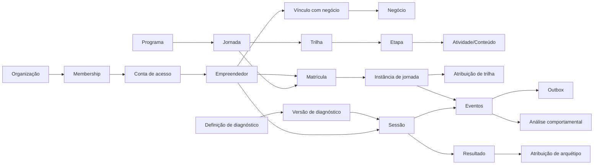

# Modelo de domínio da Plataforma Estímulo

**Versão:** 1.0  
**Revisado em:** 2026-09-01  
**Status:** modelo conceitual alinhado ao runtime vigente

## Princípios

1. Conta de acesso, empreendedor, negócio e organização são conceitos distintos.
2. Conteúdo, curso, trilha e jornada são capacidades diferentes e reutilizáveis.
3. Jornada é uma entidade operacional única com estado `draft` ou `published`; publicação não cria uma nova versão editorial.
4. Nomes físicos legados como `journey_version_id` permanecem como detalhe de compatibilidade do schema e não redefinem o conceito de produto.
5. Diagnósticos, documentos legais e outras capacidades que efetivamente usam definição–versão–instância continuam preservando a versão utilizada.
6. Eventos, ledgers, aceites, resultados, submissões e auditoria preservam fatos históricos independentemente de edição ao vivo de jornada.
7. Arquétipo e score comportamental não são atributos cadastrais permanentes e não decidem crédito.
8. Administração usa os mesmos casos de uso autorizados do domínio; não existe um backend paralelo de edição.
9. Integrações externas ficam na borda e consomem outbox; PostgreSQL é a fonte operacional.

## Mapa conceitual



## Identidade e organizações

- `UserAccount`: identidade autenticável e status da conta.
- `Entrepreneur`: pessoa participante, separada da credencial.
- `Business`: negócio beneficiário.
- `BusinessMembership`: relação temporal pessoa–negócio.
- `Organization`: Estímulo e organizações operadoras.
- `OrganizationMembership`: vínculo que habilita escopo organizacional e RBAC.
- identificadores externos nunca substituem UUIDs internos.

### Administração

No adapter Supabase atual, a entrada administrativa exige identidade Google validada, e-mail confirmado, identidade interna resolvida e membership ativa na organização Estímulo. Permissões específicas continuam sendo avaliadas por RBAC. O domínio do e-mail, sozinho, não concede acesso.

## Catálogo e jornada

### Programa

Agrupa jornadas sem controlar a execução individual.

### Jornada

É a unidade longitudinal editável no produto.

```text
draft <-> published
```

- `draft`: editável, não utilizável por participante e eliminável quando as regras de integridade permitem;
- `published`: utilizável por participantes e editável ao vivo;
- despublicar retorna o mesmo registro a `draft` e encerra acessos ativos segundo o contrato do banco;
- dados já registrados por participantes seguem seus próprios contratos de retenção/auditoria.

O schema ainda contém `catalog.journey_definitions` e `catalog.journey_versions`. O runtime vigente mantém relação operacional 1:1 e usa `version_number=1`/`schema_version='single'` como compatibilidade. Esses nomes não significam que o produto ofereça snapshots editoriais de jornada.

### Trilha, etapa e atividade

Trilhas organizam etapas e critérios de progressão. Atividades e conteúdos podem continuar utilizando estruturas versionadas quando o runtime da capacidade exigir preservação de regras, tentativas ou ativos.

## Diagnóstico e personalização

Diagnóstico usa definição–versão–instância porque perguntas e cálculo precisam ser reproduzíveis por sessão. O principal pode atribuir arquétipo; diagnósticos opcionais nunca alteram arquétipo principal nem elegibilidade de jornada.

A metodologia oficial continua externa ao código: o runtime executa apenas configuração publicada e não deve inventar pesos/cortes ausentes.

## Avaliação e prática

Tentativas e submissões preservam a resposta enviada, regra aplicável e revisão. Quick checks distinguem pergunta aberta, escolha única, verdadeiro/falso e múltipla escolha. Múltipla escolha é correta somente quando o conjunto selecionado é exatamente igual ao conjunto configurado como correto.

## Gamificação e credenciais

- pontos vêm de ledger idempotente;
- saldo é projeção;
- selos são awards identificáveis e a UI só anuncia awards novos;
- certificados preservam evidência e regras de emissão;
- ranking é derivado de pontos e não expõe e-mail completo de outros participantes.

## Eventos, análise e integrações

Eventos representam fatos; outbox desacopla efeitos externos. Features e score comportamental são analíticos e não alteram acesso, recomendação, jornada, recompensa ou crédito.

## Fonte de verdade

Este documento descreve conceitos. Para estado físico, use:

- [`../data/database/DATABASE_MODEL.md`](../data/database/DATABASE_MODEL.md);
- `supabase/migrations/` para schema e comportamento executável;
- [`../journeys/JOURNEY_LIFECYCLE.md`](../journeys/JOURNEY_LIFECYCLE.md) para ciclo de vida de jornada;
- [`../implementation/APPLICATION_FOUNDATION.md`](../implementation/APPLICATION_FOUNDATION.md) para composição da aplicação.