# Ciclos de vida e máquinas de estado

**Versão:** 0.1  
**Data:** 2026-07-08  
**Status:** Proposta técnica  
**Escopo:** E05-T03

## 1. Objetivo

Definir estados e transições válidas para entidades centrais. Estes estados são conceituais; nomes finais no banco e na API serão definidos no modelo lógico.

## 2. Regras gerais

- estados não devem ser texto livre;
- transições passam por casos de uso autorizados;
- toda transição relevante gera evento;
- estados terminais não são revertidos por edição direta;
- transições administrativas exigem justificativa e auditoria;
- timestamps de entrada em estado devem ser preservados;
- status atual é projeção do histórico, não substituto dele.

## 3. Versão de jornada, curso, diagnóstico e regras

Estados comuns:

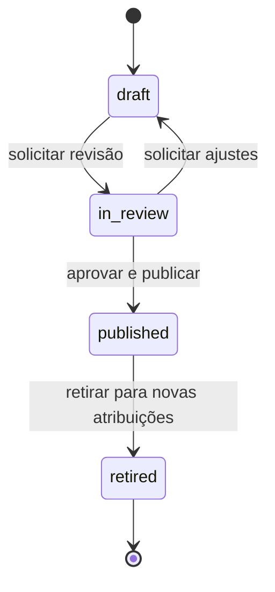

### Regras

- `draft`: editável e não executável por participantes;
- `in_review`: bloqueada para edição comum ou editada por nova revisão controlada;
- `published`: imutável e disponível conforme vigência;
- `retired`: não gera novas atribuições, mas permanece disponível para histórico e participantes existentes conforme política.

Uma versão publicada incorreta não é editada. Cria-se nova versão e registra-se uma política de migração.

## 4. Programa

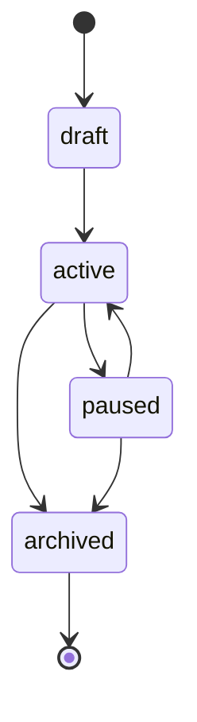

- `paused` impede novas entradas, sem invalidar necessariamente participações existentes;
- `archived` encerra uso operacional e preserva histórico.

## 5. Participação em jornada

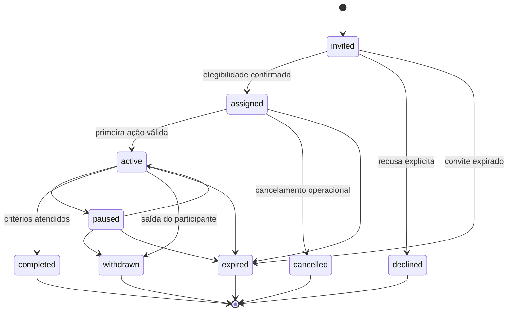

### Observações

- `assigned` significa jornada e trilha formalmente atribuídas;
- conclusão exige critérios da versão, não apenas 100% visualizado;
- reentrada posterior cria nova participação ou extensão explicitamente registrada;
- migração de versão não altera a participação silenciosamente.

## 6. Atribuição de trilha

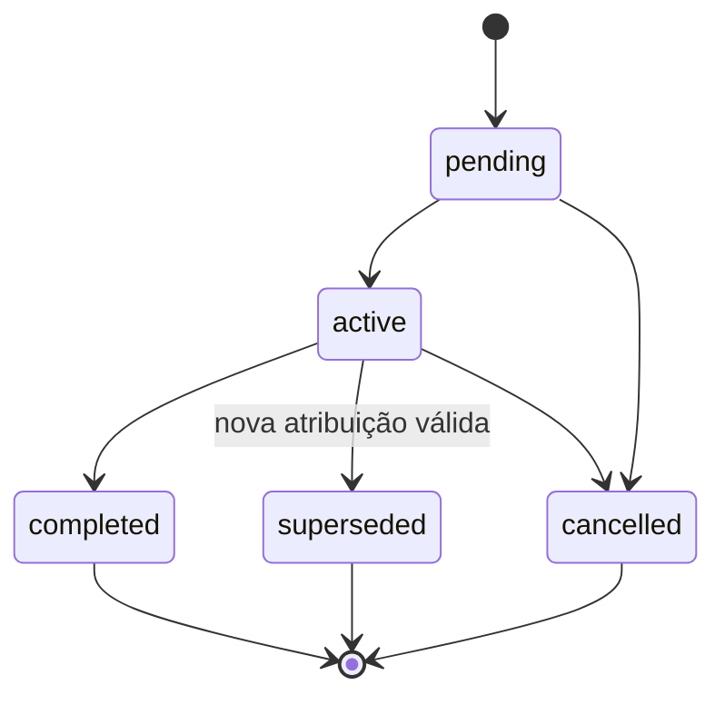

A atribuição mantém:

- política e versão;
- entradas utilizadas;
- justificativa;
- confiança/indeterminação, quando aplicável;
- quem ou o que aprovou a decisão.

## 7. Instância de atividade

Estado comum a todos os tipos:

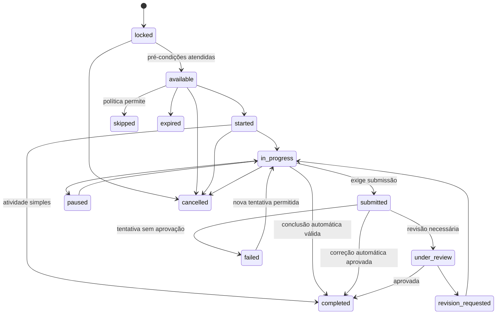

### Regras por subtipo

- conteúdo simples pode ir de `started` para `completed` após critério verificável;
- avaliação utiliza tentativas próprias; falhar uma tentativa não cancela a atividade;
- prática pode passar por `submitted`, `under_review` e `revision_requested`;
- `skipped` só existe quando a versão da jornada permite.

## 8. Sessão diagnóstica

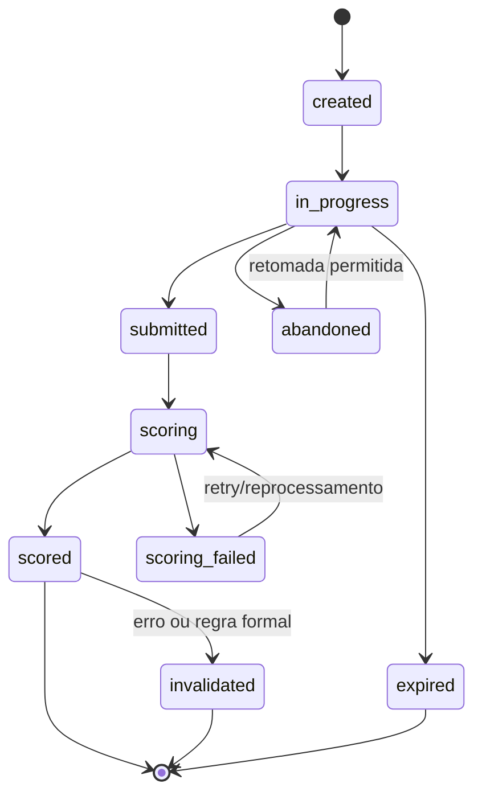

- resposta pode ser alterada enquanto a sessão está `in_progress`;
- `submitted` congela o conjunto de respostas daquela execução;
- novo cálculo preserva a execução anterior;
- invalidação exige motivo e auditoria.

## 9. Tentativa de avaliação

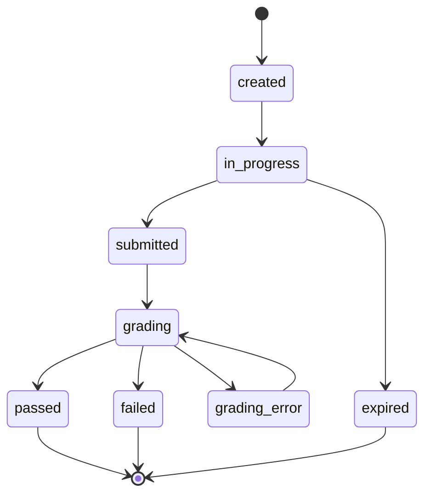

- cada tentativa guarda a versão da avaliação;
- número máximo e intervalo entre tentativas pertencem à configuração da atividade;
- correção posterior não sobrescreve o resultado original sem registro de regrade.

## 10. Submissão prática

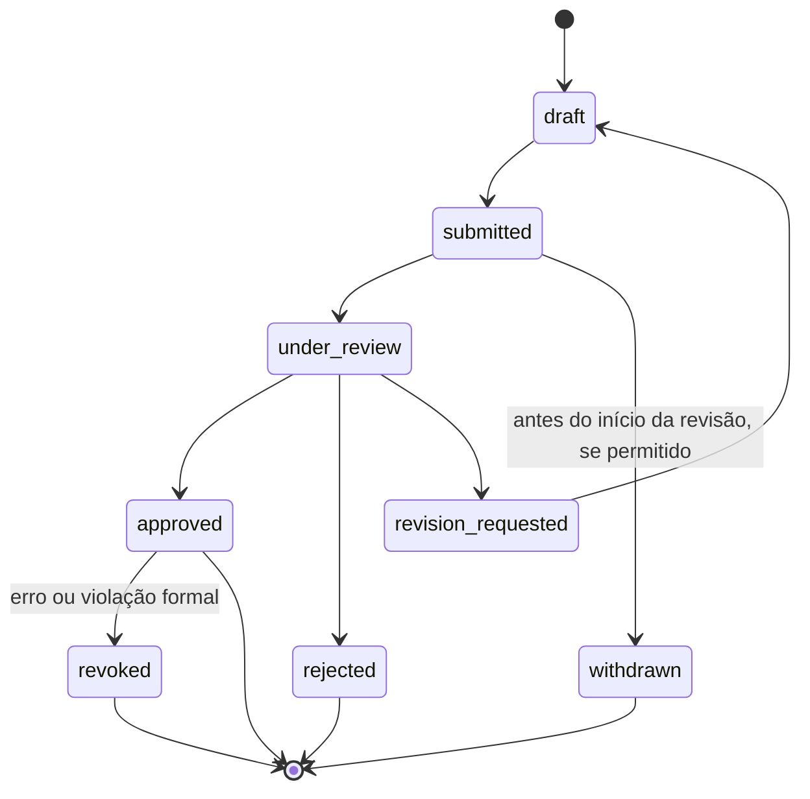

- submissão enviada não deve ser apagada pelo participante;
- uma revisão nova complementa o histórico;
- anexos seguem política própria de retenção e segurança.

## 11. Intervenção

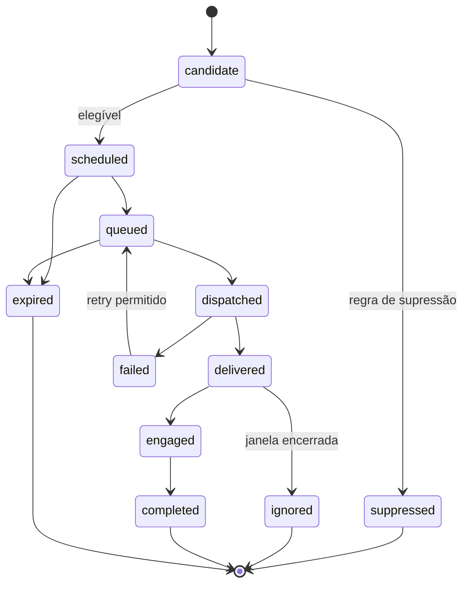

A intervenção de negócio é separada das tentativas de entrega por canal.

## 12. Certificado

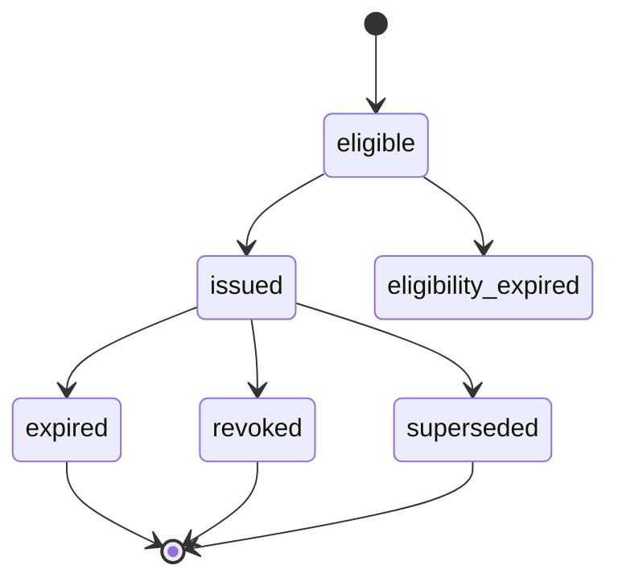

- elegibilidade é calculada por critérios versionados;
- emissão preserva evidências;
- revogação não remove o certificado do histórico, mas altera a validade pública.

## 13. Processamento de evento

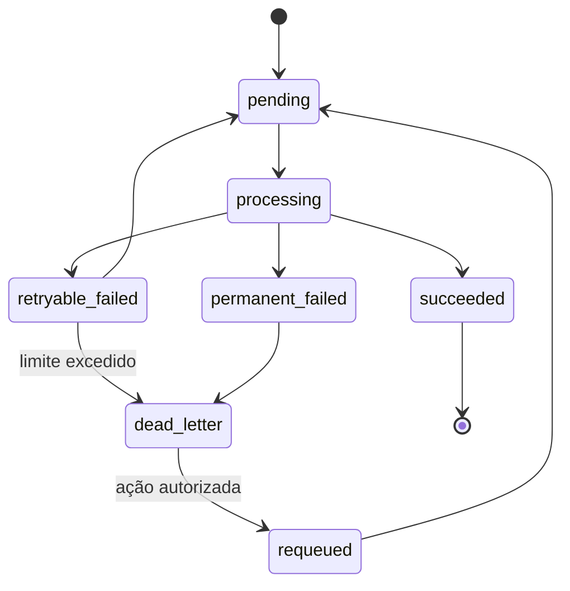

## 14. Sincronização externa

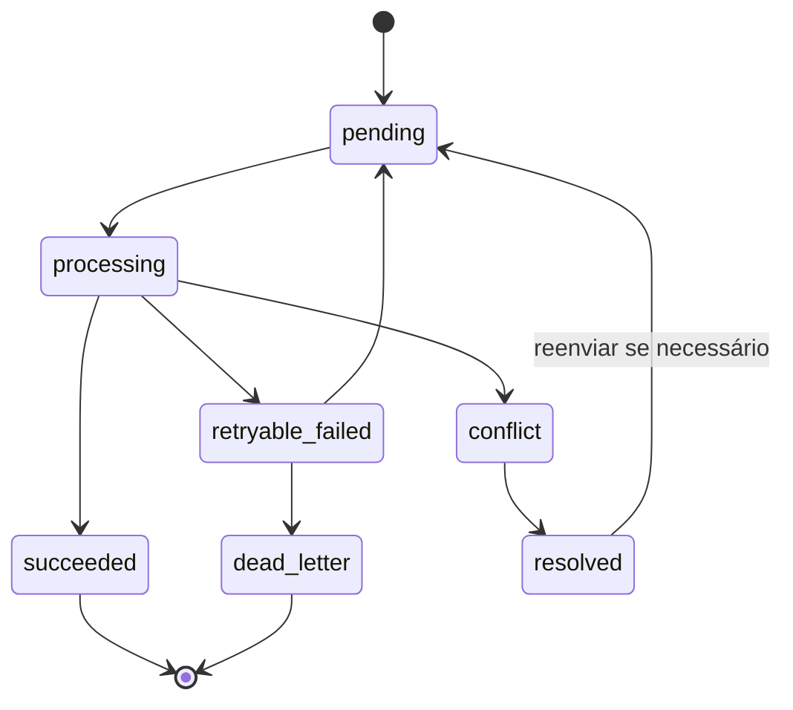

## 15. Transições ainda dependentes de definição

- estados reais da operação de crédito;
- regras de pausa/expiração da Jornada OpenAI;
- possibilidade de retirada do consentimento durante uma participação;
- política de migração de participantes entre versões;
- SLA de revisão de atividades práticas;
- validade e expiração de certificados.
