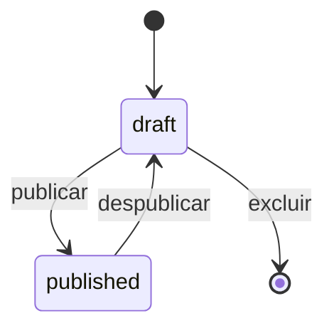
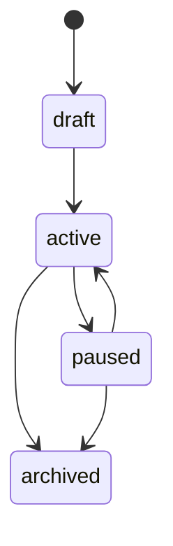
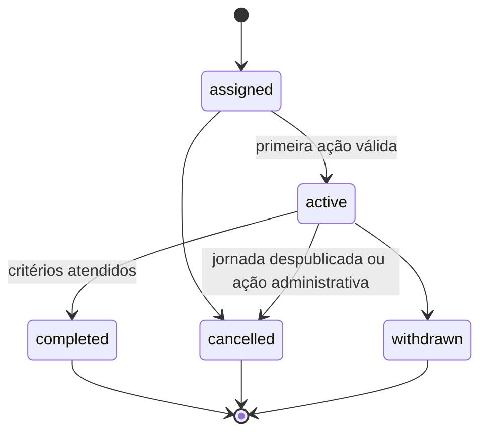
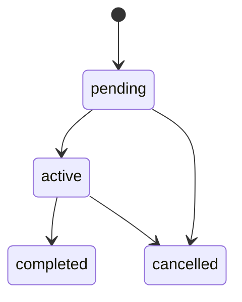
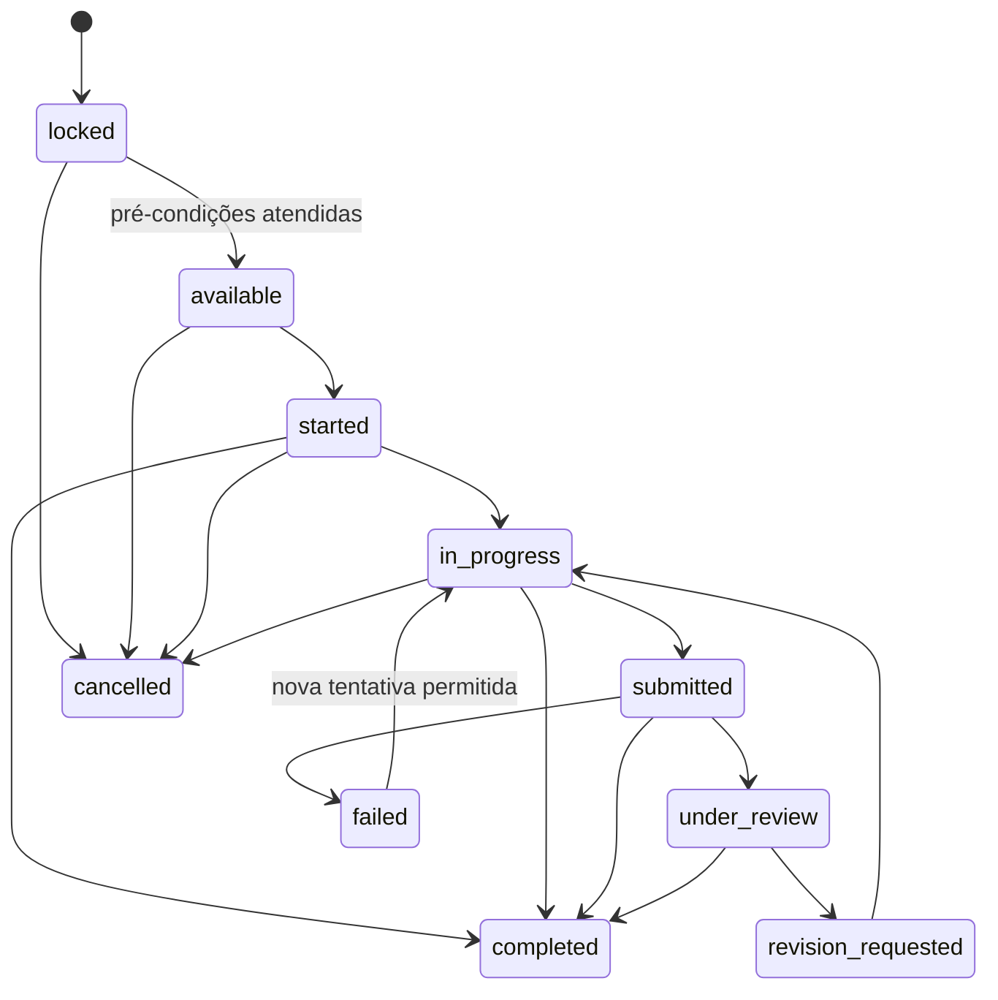
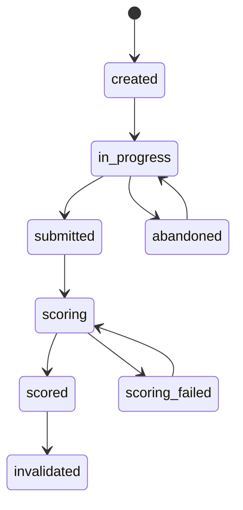
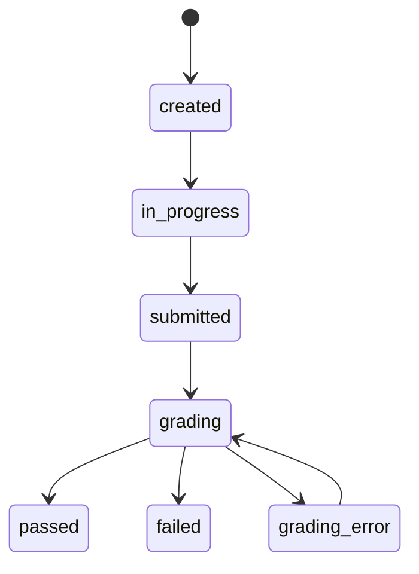
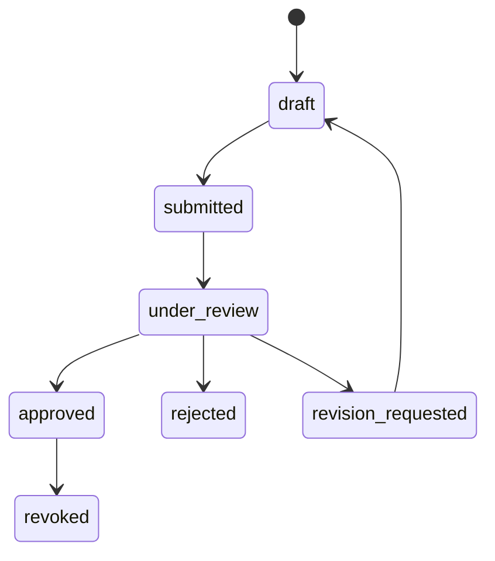
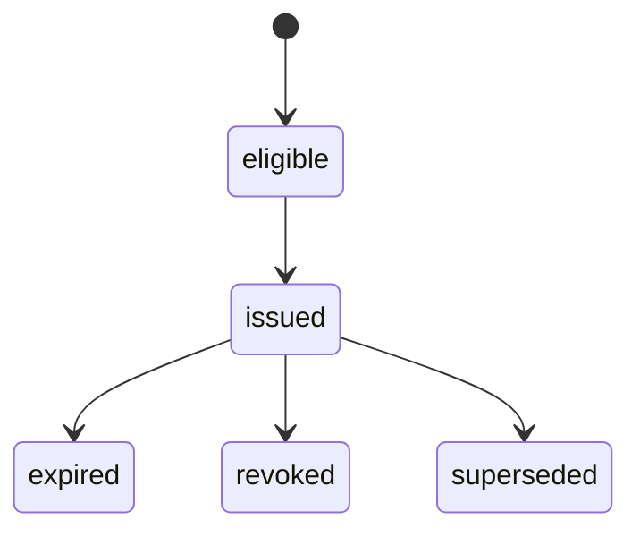
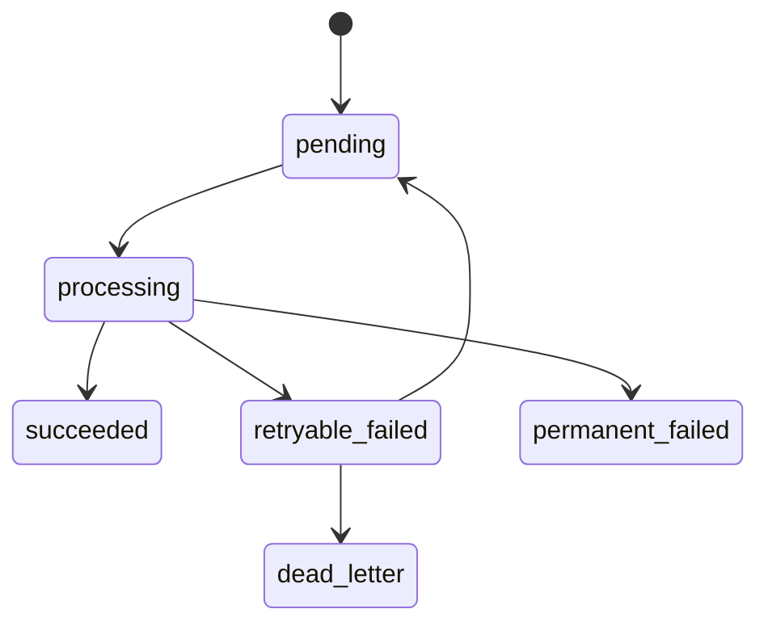

# Ciclos de vida e máquinas de estado

**Revisado em:** 2026-08-01  
**Status:** implementação vigente e contratos conceituais complementares

## Regras gerais

- estados não são texto livre;
- transições passam por casos de uso autorizados;
- operações relevantes geram auditoria e, quando aplicável, evento;
- fatos de execução não são reescritos por edição editorial;
- timestamps e razões de cancelamento são preservados.

## Jornada

A jornada é única e possui dois estados visíveis:

- `draft`: editável, indisponível ao participante e passível de exclusão;
- `published`: disponível e editável ao vivo;
- publicar e despublicar alteram o mesmo registro;
- não existe nova versão, snapshot selecionável ou migração de participantes;
- a despublicação interrompe o uso ativo segundo o contrato do banco.

Identificadores internos com nome `journey_version_id` são compatibilidade técnica 1:1 e não constituem um terceiro estado ou sistema de versões.

## Programa

## Participação em jornada

A participação aponta para a jornada operacional vigente. Alterações editoriais são percebidas no próximo carregamento, sem migração entre versões.

## Atribuição de trilha

## Instância de atividade

## Sessão diagnóstica

## Tentativa de avaliação

Cada tentativa preserva perguntas, respostas e resultado necessários para auditoria, mesmo quando a atividade é editada depois.

## Submissão prática

## Certificado

## Processamento de evento e sincronização

## Definições ainda abertas

- SLA de revisão de atividades práticas;
- validade e expiração de certificados;
- políticas institucionais de retenção por categoria de dado;
- arquitetura AWS definitiva e estados operacionais associados.
