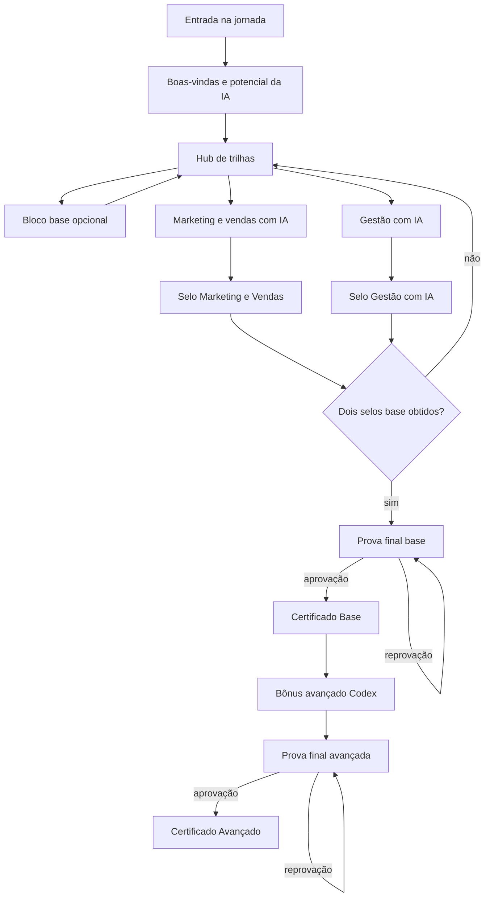

# Especificação da Jornada OpenAI

**Versão da especificação:** 0.1  
**Data:** 2026-07-08  
**Status:** Proposta executável para validação editorial  
**Fontes primárias:** `rascunho-validacao-jornada-capacitacao-ia-digital-mei_me.docx.pdf` e contexto oficial do projeto  
**Fonte secundária:** `modules/journey/journey-data.ts`, usada somente para comparação com a fundação técnica

## 1. Objetivo

Converter o conteúdo final de referência da capacitação em IA em uma definição de jornada versionada, independente de telas e de código específico. A especificação descreve o que deve ser publicável e executável pela plataforma; não aprova ainda as perguntas das provas, notas mínimas, materiais finais ou o conteúdo técnico produzido.

## 2. Identidade da jornada

| Campo | Valor proposto |
|---|---|
| Programa | Capacitação de Crédito |
| Definição de jornada | Capacitação em IA para pequenos negócios |
| Código estável | `ai_for_small_business` |
| Parceiro editorial | OpenAI |
| Público declarado na fonte | MEI/ME, iniciantes em IA, com extensão opcional avançada |
| Canal inicial | Aplicação web responsiva |
| Idioma inicial | Português do Brasil |
| Ferramenta das trilhas base | ChatGPT |
| Ferramenta do bônus avançado | Codex |
| Modalidade | Assíncrona, prática e modular |
| Status da primeira versão | `draft` até concluir os bloqueios editoriais |
| Objetivo geral | Permitir que pequenos empreendedores usem IA de forma prática em marketing, vendas, gestão e criação de artefatos digitais |

## 3. Resultados esperados

A jornada deve separar cinco níveis de resultado:

1. **Exposição:** o participante acessou ou concluiu uma unidade.
2. **Compreensão:** demonstrou entendimento em uma avaliação.
3. **Produção:** criou um artefato ou resultado prático.
4. **Aplicação:** relatou ou demonstrou uso no próprio negócio.
5. **Resultado do negócio:** mudança posterior fora da jornada, que não pode ser inferida apenas pela conclusão.

A conclusão da jornada não comprova impacto no negócio nem redução de risco de crédito.

## 4. Arquitetura da experiência

### Regras estruturais derivadas da fonte

- Boas-vindas é obrigatório e antecede o hub de trilhas.
- O bloco base é opcional e não impede o acesso às duas trilhas base.
- Marketing e Gestão podem ser cursadas em qualquer ordem depois das boas-vindas.
- O envio do resultado prático é opcional na versão de referência.
- Cada trilha base possui prova própria e selo.
- O Certificado Base exige os dois selos base e aprovação na prova final base.
- O bônus Codex é desbloqueado somente após o Certificado Base.
- O Certificado Avançado exige a conclusão do bônus e aprovação na prova final avançada.
- Como o Codex é um bônus, a participação pode ser considerada concluída no nível base após o Certificado Base, mantendo o nível avançado como extensão opcional.

## 5. Estrutura editorial

### 5.1 Bloco 0 - Boas-vindas e potencial da IA

| Campo | Especificação |
|---|---|
| Código | `welcome_ai_potential` |
| Obrigatoriedade | Obrigatório |
| Nível | Iniciante |
| Objetivo | Contextualizar, motivar, explicar a jornada e promover o primeiro contato prático |
| Reconhecimento | Selo Potencial da IA |
| Regra de entrada | Participação ativa na versão da jornada |
| Regra de saída | Unidades obrigatórias concluídas conforme política da versão |

| Código da fonte | Unidade | Duração da fonte | Ativos declarados | Competências principais |
|---|---|---:|---|---|
| 0.1 | Quem é seu professor / O que sushi tem a ver com IA? | 3 min | Slide | C01 |
| 0.2 | Por que você está aqui? | 3 min | Slide | C01 |
| 0.3 | Potencial da IA nos pequenos negócios | 4 min | Slide, artigos | C01, C02 |
| 0.4 | Como funciona a jornada / Falando por voz com o ChatGPT | 3 min | Slide, mapa visual, mapa da ferramenta | C02, C03 |
| 0.5 | O que o aluno vai conseguir criar | 3 min | Slide, resultados práticos | C02 |

**Inconsistência:** as unidades somam 16 minutos, enquanto o bloco declara 15 minutos. A duração publicada deve ser calculada a partir das unidades após revisão editorial.

### 5.2 Bloco B - Base opcional

| Campo | Especificação |
|---|---|
| Código | `chatgpt_foundations` |
| Obrigatoriedade | Opcional |
| Nível | Iniciante |
| Objetivo | Preparar o participante para solicitar, configurar e usar o ChatGPT com maior qualidade e segurança |
| Reconhecimento | Selo Base IA |
| Regra de entrada | Boas-vindas concluídas |
| Regra de saída | Unidades do bloco concluídas |
| Efeito sobre certificado base | Nenhum na versão de referência |

| Código da fonte | Unidade | Duração | Ativos declarados | Competências |
|---|---|---:|---|---|
| B0 | O que será visto neste bloco | 2 min | Slide | C01 |
| B1 | Como pedir melhor para IA | 8 min | Slide, framework de prompt, material explicativo | C03, C04 |
| B3 | Configurando o ChatGPT | 10 min | Slide, mapa da ferramenta | C05 |

**Lacuna:** não existe B2 na fonte. O código não deve ser renumerado automaticamente antes da validação editorial.

### 5.3 Trilha 1 - Marketing e vendas com IA

| Campo | Especificação |
|---|---|
| Código | `marketing_sales_ai` |
| Obrigatoriedade para certificado base | Obrigatória |
| Nível | Iniciante |
| Objetivo | Criar materiais de marketing, scripts de vendas e propostas com apoio de IA |
| Entrega prática declarada | Mini campanha de marketing e/ou script de vendas |
| Reconhecimento | Selo Marketing e Vendas |
| Regra de entrada | Boas-vindas concluídas |
| Regra de saída | Conteúdo obrigatório concluído e prova da trilha aprovada |

| Código da fonte | Unidade | Duração | Ativos declarados | Competências |
|---|---|---:|---|---|
| 1.1 | Caso de uso inicial | 5 min | Slide | C06 |
| 1.2 | Calendário editorial, posts, legendas, logo e edição de imagem | 15 min | Prompts, passo a passo, templates | C06, C07 |
| 1.4 | Scripts de venda e proposta comercial | 10 min | Biblioteca de prompts, passo a passo | C08 |
| 1.5 | Aula final | 1 min | Avaliação do módulo | C06-C08 |
| T1-EXAM | Prova da trilha | 5 min declarados | Banco de questões ainda ausente | C06-C08 |
| T1-PRACTICE | Resultado prático opcional | duração variável | Texto, imagem, PDF, prompt ou arquivo | C07, C08, C12 |

**Inconsistências:** não existe 1.3; as aulas somam 31 minutos antes da prova, embora a fonte declare 30 minutos. A expressão “mini campanha / script” não esclarece se o participante escolhe uma entrega ou deve entregar ambas.

### 5.4 Trilha 2 - Gestão com IA

| Campo | Especificação |
|---|---|
| Código | `business_management_ai` |
| Obrigatoriedade para certificado base | Obrigatória |
| Nível | Iniciante/intermediário |
| Objetivo | Usar IA para organização financeira, leitura assistida de documentos e estruturação de rotinas |
| Entregas práticas declaradas | Assistente financeiro, análise de contrato e checklist operacional |
| Reconhecimento | Selo Gestão com IA |
| Regra de entrada | Boas-vindas concluídas |
| Regra de saída | Conteúdo obrigatório concluído e prova da trilha aprovada |

| Código da fonte | Unidade | Duração | Ativos declarados | Competências |
|---|---|---:|---|---|
| 2.1 | Caso de uso inicial | 5 min | Slide | C09 |
| 2.2 | Assistente financeiro simples | 15 min | Prompt | C09 |
| 2.3 | Resumo de contrato | 5 min | Prompt, contrato de exemplo | C10, C13 |
| 2.4 | Checklist operacional | 5 min | Prompt | C11 |
| 2.5 | Aula final | 1 min | Avaliação do módulo | C09-C11 |
| T2-EXAM | Prova da trilha | 5 min declarados | Banco de questões ainda ausente | C09-C11, C13 |
| T2-PRACTICE | Resultado prático opcional | duração variável | Texto, imagem, PDF, prompt ou arquivo | C09-C12 |

**Inconsistência:** as aulas somam 31 minutos antes da prova, embora a fonte declare 30 minutos. Não está definido se a atividade prática exige um, alguns ou todos os três artefatos.

### 5.5 Trilha 3 - Bônus avançado Codex

| Campo | Especificação |
|---|---|
| Código | `advanced_codex_systems` |
| Obrigatoriedade | Opcional/avançado |
| Nível | Avançado |
| Objetivo | Criar e evoluir artefatos digitais e sistemas simples com IA |
| Pré-requisito | Certificado Base emitido e válido |
| Entrega prática | Projeto avançado, escopo ainda a definir |
| Reconhecimento | Selo Desenvolvimento com IA e Certificado Avançado |

| Código da fonte | Unidade | Duração | Ativos declarados | Competências |
|---|---|---:|---|---|
| 3.1 | O que é Codex e primeiros passos | não especificada por aula | Guia quando usar Codex | C14 |
| 3.2 | Criar site com IA | não especificada por aula | Modelo de landing page pendente | C15 |
| 3.3 | Criar slides com IA | não especificada por aula | Apresentação comercial pendente | C15 |
| 3.4 | Criar sistema simples | não especificada por aula | Briefing pendente | C15, C16 |
| 3.5 | Evoluir projeto | não especificada por aula | Checklist de evolução | C16 |
| T3-EXAM | Prova final avançada | 10 min | Banco de questões ausente | C14-C16 |
| T3-PRACTICE | Entrega prática avançada | duração variável | Arquivos e links a definir | C15, C16, C12 |

**Inconsistência:** a fonte declara 30 minutos de conteúdo mais 10 minutos de prova; o código atual atribui 8 minutos a cada uma das cinco aulas, totalizando 40 minutos antes da prova.

## 6. Padrão de cada unidade de aprendizagem

A fonte estabelece o padrão abaixo. A implementação deve representar seus componentes separadamente para permitir eventos e análises distintos.

1. Problema real.
2. Exemplo guiado.
3. Demonstração prática.
4. Pausa prática.
5. Avaliação rápida.
6. Material complementar.
7. Avaliação opcional por estrelas.

Uma unidade não deve ser considerada “aplicada no negócio” apenas porque o vídeo foi concluído ou a pergunta rápida foi respondida.

## 7. Estados da jornada

### Definição e versão

`draft -> in_review -> approved -> published -> deprecated -> archived`

### Participação

`assigned -> available -> started -> active -> base_completed -> fully_completed`

Estados alternativos: `paused`, `expired`, `cancelled`.

- `base_completed`: Certificado Base emitido.
- `fully_completed`: Certificado Avançado emitido.
- Como o bônus é opcional, `base_completed` é um resultado terminal válido.

## 8. Duração

A duração oficial não deve ser um campo digitado manualmente como fonte de verdade. Ela será derivada da soma das atividades publicadas, com campos separados para:

- duração estimada de conteúdo;
- duração estimada de avaliações;
- duração estimada de prática;
- duração total obrigatória para base;
- duração total opcional;
- duração total avançada.

Antes da publicação, os conflitos de duração listados neste documento precisam ser resolvidos.

## 9. Critérios mínimos para publicação da versão 1.0

- vídeos e materiais finais associados a ativos versionados;
- transcrições, legendas e metadados de acessibilidade;
- objetivos e competências aprovados;
- regras de progressão estruturadas;
- perguntas, respostas, justificativas e notas mínimas das avaliações;
- política de tentativas e feedback;
- especificação das entregas práticas e rubricas;
- política de pontos aprovada;
- definições finais de selos e certificados;
- termos de envio e autorização de uso de resultados;
- revisão de segurança dos conteúdos financeiros, contratuais e de IA;
- duração recalculada e reconciliada;
- teste completo do fluxo em sandbox.

## 10. Itens não decididos nesta etapa

- personalização por diagnóstico ou arquétipo;
- atribuição por momento de crédito;
- regras específicas dos três públicos prioritários;
- perguntas e notas das avaliações;
- obrigatoriedade de cada prática;
- revisão humana das submissões;
- prazos e expiração;
- critérios de migração entre versões;
- uso de comportamento no score.

Esses itens não devem ser preenchidos por inferência no código.
