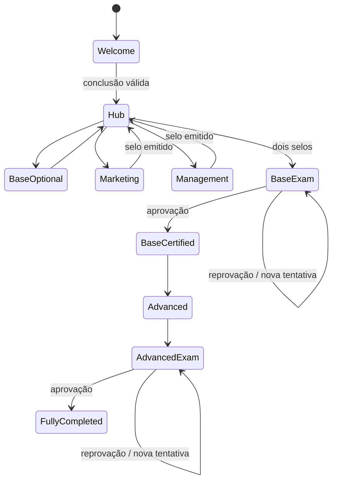

# Regras de progressão - Jornada OpenAI

**Versão:** 0.1  
**Status:** Proposta estruturada; parâmetros pedagógicos ainda pendentes

## 1. Princípios

- Regras serão armazenadas como dados estruturados e versionados.
- Texto descritivo não será usado como regra executável.
- Cada decisão de progressão registrará a versão da regra e as evidências usadas.
- Conteúdo visto, unidade concluída, avaliação aprovada e prática aplicada são estados diferentes.
- O participante não será migrado automaticamente para uma nova versão publicada.

## 2. Grafo de progressão

| Origem | Condição | Destino | Tipo |
|---|---|---|---|
| Entrada | participação disponível | Boas-vindas | obrigatório |
| Boas-vindas | conclusão válida | Hub de trilhas | obrigatório |
| Hub | escolha do participante | Base opcional | opcional |
| Base opcional | conclusão ou saída voluntária | Hub | retorno |
| Hub | Boas-vindas concluídas | Marketing | escolha |
| Hub | Boas-vindas concluídas | Gestão | escolha |
| Marketing | prova da trilha aprovada | Selo Marketing | reconhecimento |
| Gestão | prova da trilha aprovada | Selo Gestão | reconhecimento |
| Selos base | ambos emitidos | Prova final base | desbloqueio |
| Prova final base | aprovação | Certificado Base | reconhecimento |
| Certificado Base | emitido e válido | Codex | desbloqueio |
| Codex | conteúdo/requisitos concluídos | Prova final avançada | obrigatório no bônus |
| Prova final avançada | aprovação | Certificado Avançado | reconhecimento |

## 3. Política de conclusão de unidade

Uma unidade pode registrar estados independentes:

- `available`;
- `started`;
- `content_progressed`;
- `content_consumed`;
- `quick_check_submitted`;
- `quick_check_satisfied`;
- `practice_started`;
- `practice_completed`;
- `feedback_submitted`;
- `completed`.

### Regra proposta para a primeira versão

A conclusão técnica da unidade exige:

1. consumo mínimo do conteúdo definido pelo tipo de mídia;
2. submissão da avaliação rápida quando existir;
3. nenhum requisito de estrelas, pois o feedback é opcional;
4. pausa prática registrada separadamente e obrigatória apenas quando a atividade for configurada como gate.

A porcentagem mínima de vídeo, a possibilidade de pular e a natureza obrigatória da pausa prática permanecem parâmetros pendentes.

## 4. Política do bloco base opcional

- disponível após a conclusão das boas-vindas;
- pode ser iniciado antes, entre ou depois das trilhas base;
- não bloqueia os selos de Marketing e Gestão;
- não bloqueia o Certificado Base na fonte atual;
- sua conclusão gera reconhecimento próprio;
- a plataforma pode recomendá-lo sem convertê-lo silenciosamente em obrigatório.

## 5. Ordem das trilhas base

Marketing e Gestão são paralelas. A escolha inicial não deve impedir o acesso posterior à outra trilha.

## 6. Provas e tentativas

A estrutura deve suportar:

- nota mínima configurável;
- limite de tentativas configurável;
- intervalo entre tentativas;
- randomização de questões;
- feedback imediato, diferido ou parcial;
- preservação de todas as tentativas;
- desbloqueio a partir da tentativa aprovada;
- reavaliação após atualização curricular.

Nenhum valor final de nota ou quantidade de tentativas foi definido pela fonte.

## 7. Atividades práticas

Na fonte, o envio é opcional e não bloqueia selos ou certificados. A plataforma deve distinguir:

- prática sugerida durante a unidade;
- entrega opcional para pontos;
- evidência revisada pela equipe;
- caso selecionado para divulgação;
- autorização de uso de conteúdo/imagem.

Uma submissão pode ser recusada para divulgação sem apagar a evidência histórica de que foi enviada.

## 8. Estados de participação

| Estado | Condição de entrada | Saída principal |
|---|---|---|
| `assigned` | atribuição criada | disponibilização |
| `available` | janela ativa e elegibilidade válida | primeiro início |
| `started` | primeira ação válida | atividade contínua |
| `active` | progresso recente | base concluída, pausa, expiração |
| `paused` | regra ou ação explícita | retomada |
| `base_completed` | Certificado Base emitido | bônus ou encerramento válido |
| `fully_completed` | Certificado Avançado emitido | estado terminal |
| `expired` | prazo excedido | reativação ou nova participação |
| `cancelled` | cancelamento justificado | estado terminal |

## 9. Pendências de decisão

- limite de consumo de vídeo para conclusão;
- quick check como gate ou apenas registro;
- nota mínima e tentativas de cada prova;
- prazo total da jornada;
- expiração de selos/certificados;
- obrigatoriedade de prática para certificação;
- política de retorno após reprovação;
- migração de participantes entre versões;
- regras de acessibilidade para equivalência de atividades.
